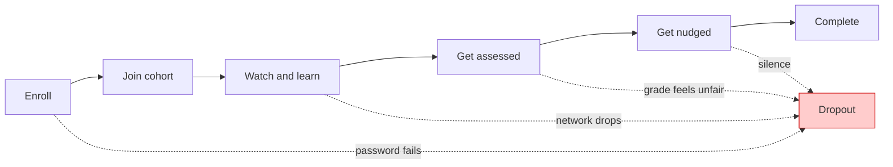

I walked into this work assuming a learning platform was mostly content. Record a lecture, upload a file, add a quiz, done. Two weeks in, I watched a student try to submit a quiz on a phone with one bar of signal. She answered three questions, hit save, the network dropped, and everything she typed disappeared. No error, no recovery. She just closed the tab.

That was the moment I understood what I was actually building.

I am building a learning platform where a young person with a phone and intermittent data can start, keep, and prove their learning, at the scale of thousands, not dozens. The young population here is massive and hungry to learn. Classrooms are not. If this platform does not work on a cheap Android, on expensive data, with power that flickers, it does not work at all.

This is not a generic platform with an African skin. It is a different design problem.

### How I learned the constraints

I assumed scale meant more servers. It actually means more humans. A cohort here is not thirty students, it is two hundred. A course is not run once, it is run in ten cohorts across regions. Everything I built for one course had to survive being duplicated, reassigned, and graded at bulk.

I assumed the network was reliable. It is not. Students share data bundles, switch between Wi-Fi and mobile, and lose connection mid-answer. Every save I designed as a single request that could fail had to become a save that could be retried without duplication or loss.

I assumed completion was about motivation. It is about friction. Can you log in without a help desk? Can you find your group? Can you see if you passed before you pay for more data to try again? Each small friction is a dropout.

### What I chose to build

Over the last months I broke the problem into five builds, each one removing one way a learner quietly disappears:

**Letting learners in**, without passwords becoming a wall. Magic links, clean enrollment states, handling churn when a student is added, removed, or re-added across cohorts.

**Building groups that scale**, not just creating groups, but making them survive auto-creation for hundreds of students, protect integrity, and not collapse when a teacher archives a set.

**Delivering learning on low bandwidth**, moving student traffic to typed gRPC, making video one cheap query, letting teachers reuse questions instead of rebuilding.

**Making assessment trustworthy**, eligibility that is explicit, autosave that survives a disconnect, rubrics that are visible, and grading that works per-cohort in one action with an audit trail.

**Keeping learners coming back**, reminders that respect fire time, notifications that fan out once per learner and not per tenant, and a health view so a teacher sees who is at risk this week, not next term.

### What I left exposed

I have not solved everything. Email delivery for magic links still depends on providers learners trust. Offline-first is still partial. We save per question, but not yet per keystroke. The health dashboard shows risk, but does not yet explain why a student went quiet.

This series walks through each build the way it happened: what I found, what I assumed, where I was exposed, what I chose, and what changed. Each post has a diagram, a code slice, and one result I can point to.

If you are an educator, read this for the learner journey. If you are an engineer, read it for the tradeoffs. Both are the same story.
