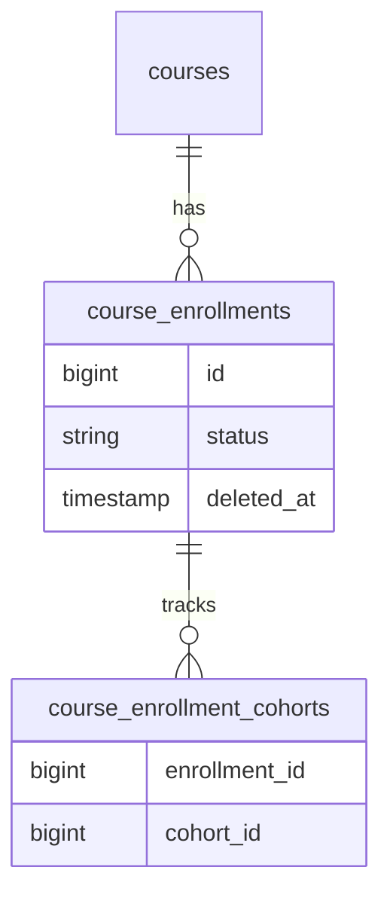
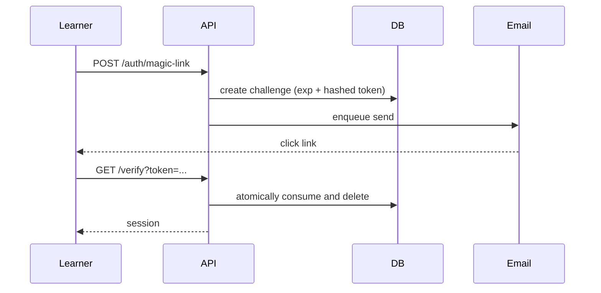

I thought letting learners in was solved. Create a user, enroll them, email a password. It worked locally, then a coordinator re-added fifty removed students. Half came back as duplicates, half as ghosts. That was the first time I felt exposed. My model did not know enrollment is a lifecycle, not a row.

## Part 1: Modeling enrollment so churn does not lose anyone

### What I found
Enrollment was a single table with a boolean. Removed meant hard-delete, returned meant insert. Across cohorts a student could be in two states at once. Reporting counted wrong. The data did not remember why a learner left.

### What I assumed
I assumed removal was rare, so a soft flag was enough. In a platform built for massive youth cohorts, removal and re-enrollment is normal. Cohorts shift, eligibility changes, bulk imports overwrite.

### Where I was exposed
I traced a support ticket: a learner showed as enrolled in the admin list but could not see the course. The query joined `course_enrollments` to `course_enrollment_cohorts` and found two rows, one active, one soft-deleted, and picked the wrong one. I had not modeled the state explicitly, so every query invented its own truth.



### What I chose
I introduced an explicit status enum with an `IsValid()` guard and a separate cohorts table. Each enrollment now carries `status`; cohort membership is a join.

```go
// internal/features/enrollments/domain/status.go:12
type EnrollmentStatus string
const (
    StatusActive    EnrollmentStatus = "active"
    StatusSuspended EnrollmentStatus = "suspended"
    StatusRemoved   EnrollmentStatus = "removed"
)
func (s EnrollmentStatus) IsValid() bool { /* ... */ }
```

**Why not just `suspended_at`?** Cohorts need bulk ops and reporting needs one truth for "who sees the course." Enum + join lets me query by course, cohort, or status.

**Result:** `course_unpublished` and `enrollment_suspended` emit as events, bulk imports deduplicate, and the learner either sees the course or knows why not.

## Part 2: Removing the password

### What I found
Passwords were the gate. Learners forgot them, resets went to spam, help desks drowned at intake. On a phone where email is the one reliable identity, asking a learner to invent a password is asking them to fail.

### What I assumed
I assumed email delivery was someone else's problem. I shipped a basic token and let the job queue handle it. The queue did, but failures were silent. A learner clicked "send link" and nothing arrived, no error, just silence.

### Where I was exposed
I watched a learner request a link three times. Each request created a challenge, each challenge was valid, and the email never left because our SMTP config was wrong. My code returned `200`, the learner waited, and left.



### What I chose
I built a magic-link foundation with hashed tokens, short TTL, and **atomically consume and delete**, no reuse, plus binding to email and eligible courses. If delivery fails, I surface it.

```go
// internal/features/auth/service/service.go:214
if err := tx.ConsumeAndDeleteChallenge(ctx, hash); err != nil {
    return ErrChallengeNotFound // 410, not 500
}
// verify binds email + course eligibility before issuing session
if challenge.Email != req.Email { return ErrEmailMismatch }
```

**Why not OTP SMS?** Cost and coverage. Email is free for the learner and already the identity for cohorts. SMS as fallback is next, but not before we made email honest about failure.

**What is still exposed:** If the learner has no consistent email, I still have no fallback. That is the next edge.

Together, these two changes mean a learner I enroll today is still the same learner when I re-enroll them next month, and the way they get in does not depend on them remembering a string they never wanted to create.
