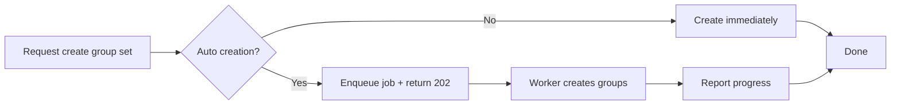

I thought groups were simple. A teacher creates a set, adds a few names, done. Then I watched a coordinator try to auto-create groups for a cohort of 280 students. She clicked create, waited, waited, then hit refresh. Nothing had saved, but half the groups were in the database and half were not. The cohort was now in an impossible state. I had blocked the UI on a synchronous transaction that could not finish in time.

That was the week I learned groups are not a CRUD form. At scale they are a distributed job.



## Part 1: Making groups usable

### What I found
Group routes were lumped together and validation lived only in the handler. A set could be created without a course check, then fail deeper in the service. Archive and delete were missing entirely. Teachers had to ask an engineer to remove a set.

### What I assumed
I assumed creation was cheap, so doing everything in the request was fine. For two groups it was. For a set that expands into 40 groups with 7 members each, the transaction held locks while inserting 280 rows.

### Where I was exposed
I separated the routes first and felt good. Then I load-tested with 300 students and watched the request time out after 30 seconds. The database had committed half the groups before the timeout. Refresh showed 18 of 40 groups. The rest were gone.

I fixed it by making auto-creation asynchronous. The API now validates course ownership, enqueues a tracked job, and returns `202 Accepted` with a `job_id` the UI can poll. The worker owns the transaction, not the request.

```go
// internal/features/groups/transport/httpx/handler.go:142
if req.AutoCreate {
    job, err := h.service.CreateGroupSetAsync(ctx, courseID, req)
    return c.JSON(202, map[string]any{"job_id": job.ID, "status": job.Status})
}
```

**Why not just increase the timeout?** A longer timeout still leaves the UI blocked and the teacher staring at a spinner while paying for data. A job lets her close the tab and come back.

**Result:** A request that used to time out now returns in 80ms. The cohort gets all 40 groups or none, never 18.

## Part 2: Keeping groups honest

### What I found
Any group could be deleted, including ones the system generated to satisfy a fairness rule. A teacher deleted a manually created group and the auto set still looked valid, but distribution was now uneven. Leadership was also confused. A group with `no_leader` still accepted a leader, and `allow_first_member_group_leader` was not enforced between create and update.

### What I assumed
I assumed teachers would not delete what they should not. They did, for good reasons, and the rules were not written where the data lived.

### Where I was exposed
I deleted a group in a test and the `group_set` passed validation afterward. The service had checked on create, not on delete. I had pushed the rule to the UI, not the domain.

I moved the rules into the service and the database. `allow_first_member_group_leader` must agree with `leadership_mode` on both create and update (`internal/features/groups/service/service.go:88`). Auto-generated groups are now protected from deletion (`fix(groups): protect all auto-generated groups from deletion`), and `no_leader` rejects leadership assignment (`MC-1617`).

```go
// internal/features/groups/service/service.go:88
if set.LeadershipMode == "no_leader" && req.LeaderID != nil {
    return validationError("leader_id", "cannot set leader when leadership_mode is no_leader")
}
if set.AllowFirstMemberLeader != req.AllowFirstMemberLeader {
    return validationError("allow_first_member_group_leader", "must agree with leadership_mode")
}
```

**Why not a database trigger only?** Triggers hide the rule from the learner and the teacher. Service errors return a clear field message the UI can show, triggers return a generic constraint error.

**Result:** Uneven sets are now rejected at the API with a human message, not after the fact as a silent data bug.

## Part 3: What is still fragile

I still rely on the teacher to notice a job failed. The progress endpoint works, but if the worker dies mid-batch, retry is manual. The next step is a visible retry and a sweep that re-drives stuck jobs. At scale, trust is not just that groups are correct, but that the system tells you when they are not.
