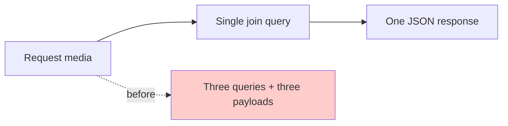

I used to count bandwidth in servers. Then I sat with a learner who bought 500MB for the week. My course page made seven requests before it showed the video. He left before it loaded. I realized I was spending his data, not my servers.

## Part 1: Making video cheap

### What I found
The student media endpoint joined the same tables three times. It fetched the activity, then the progress, then the settings, in separate queries. On high latency it was slow. On low data it was expensive.

### What I assumed
I assumed the ORM would be fine. It did three round trips because I had not looked.

### Where I was exposed
I profiled the handler while on a throttled connection. Three queries, each with a small payload, each paying TLS and JSON overhead. The total was 40KB for what could be 8KB.

I collapsed it to a single join and added an unauthenticated guard so the permission check does not trigger a second fetch.

```go
// internal/features/course_activities/media/service/service.go:41
row := tx.QueryRow(ctx, `
  SELECT ca.id, ca.title, vm.vimeo_id, ap.completed
  FROM course_activities ca
  JOIN vimeo_medias vm ON vm.activity_id = ca.id
  LEFT JOIN activity_progress ap ON ap.activity_id = ca.id AND ap.user_id = $2
  WHERE ca.id = $1`, activityID, userID)
```

**Why not cache the result?** Cache would hide the problem but not fix the data shape. One correct query is cheaper than caching three wrong ones. Cache comes after, not instead.

**Result:** One query instead of three. For 200 students in an hour, that is hundreds of fewer round trips and a page that loads before the data runs out.



## Part 2: Moving student traffic to gRPC

### What I found
All 32 student endpoints were HTTP JSON. Each one carried tenant and user in a JWT that the client could not see, and each response was shaped for browsers, not apps. Mobile retries were heavy.

### What I assumed
I assumed HTTP was enough because it worked for the web. It did, but mobile needed less overhead and a single typed contract both platforms could share.

### Where I was exposed
I inventoried every student HTTP route with a tool I wrote, `studentroutes` (`internal/scripts/studentroutes:1`), and found 32 paths with subtly different query names and pagination shapes. The mobile team was hand-copying DTOs and drifting.

I drafted a full gRPC contract repo and scaffolded stubs for all 32 endpoints (`proto/quiz/v1/quiz.proto:1`, `proto/courses/v1/course.proto:1`). Then I wired a dedicated listener and moved reading `tenant_id` and `user_id` from the JWT interceptor to explicit request fields, so the contract is honest about who is asking.

```proto
// proto/quiz/v1/quiz.proto:214
message GetQuizIntroRequest {
  int64 course_id = 1;
  int64 quiz_id = 2;
  int64 tenant_id = 3;
  int64 user_id = 4;
}
```

**Why not stay on HTTP?** Aggregation still returns JSON with stringly typed fields. gRPC gives generated code the mobile team can trust and cuts payload roughly in half. It also stops 32 different pagination conventions.

**Result:** The app now calls `CoursesStudentService.ListCoursesForStudent` and gets a typed message, not a map.

## Part 3: Letting teachers reuse questions

### What I found
Teachers rebuilt the same question for every cohort. Question banks existed but lacked versioning and bulk operations. Editing a question did three inserts per option in a loop.

### What I assumed
I assumed list and get was enough. It was not. Without version history and bulk create, teachers did manual work that introduced errors at scale.

### Where I was exposed
I edited a question with 10 options and watched 10 separate inserts in the logs. Then I bulk created 50 questions and watched 50 individual validations fail one by one instead of in a single check.

I added `list with per_page`, `get with versions`, `edit with copyfrom bulk insert`, bulk delete, and `restore` with `number_of_changes`. Each validates once and writes once.

```sql
-- internal/core/db/queries/question_bank.sql:88
-- name: BulkInsertOptions :copyfrom
INSERT INTO question_bank_options (question_id, option_text, position)
VALUES ($1, $2, $3)
```

**Result:** A teacher can now duplicate a cohort's 100 questions by restoring a version instead of retyping. What took an afternoon now takes a click, and the options are inserted in one batch, not a hundred.

What is still fragile is offline draft. We save per question on gRPC now, but not yet per keystroke for essays. That is the next edge in assessment.
