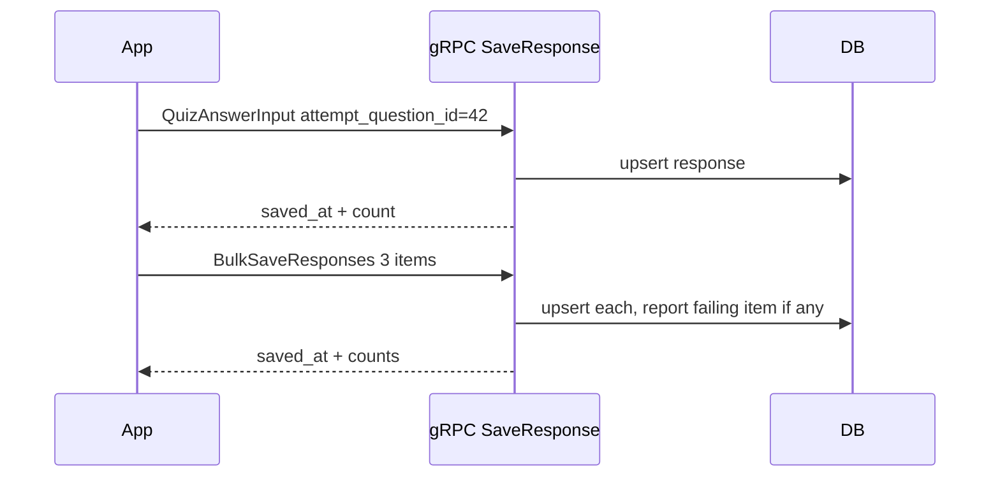

I thought assessment was about questions. Then I graded a quiz for 180 and realized it is about trust. If a learner does not trust the start is fair or that a disconnect will not steal work, they will not come back. I had built questions. I had not built trust.

## Part 1: Keeping the start fair

### What I found
Quiz intro showed the quiz but not whether you could start it. Attempts had a limit, but the UI did not know it. Students clicked start and got a 403 with no reason. Support tickets were just "it says I cannot start."

### What I assumed
I assumed the client could figure out eligibility. It could not, because the rules lived across four tables.

### Where I was exposed
I clicked start on a quiz I had already taken twice. The API returned `403 forbidden`. No `reason`, no `attempts_remaining`, no `available_until`. I opened the service and saw the logic existed but was not returned. I had gated the action but not explained the gate.

I centralized eligibility into a single object returned on every intro.

```go
// internal/features/course_activities/quiz/service/service.go:142
eligibility := QuizEligibility{
    CanStart: attemptsUsed < allowed && now.Before(availableUntil),
    Reason: reason,
    AttemptsUsed: attemptsUsed,
    AttemptsRemaining: ptr(allowed - attemptsUsed),
}
```

**Why not just a boolean?** A boolean blocks. A reason tells what to fix and whether to wait or ask for help.

**Result:** The intro answers before the click. Can you start, why or why not, and how many tries remain.

## Part 2: Saving answers when the network drops

### What I found
Quiz answers saved over a WebSocket. It worked on my laptop. On a phone with one bar, the socket broke mid essay and the learner lost a paragraph.

### What I assumed
I assumed a persistent connection was better than many small requests. On patchy networks it is the worst choice, because a single break loses the stream.

### Where I was exposed
I turned on throttling and typed an essay. I watched the socket close after 20 seconds. My next keystroke was queued locally with no retry. I had built a save that required the network to stay up.

I replaced it with native gRPC saves per question, single and bulk, over the same contract. The client saves one answer or many, the server returns `saved_at` and `saved_response_count` every time.

```proto
// proto/quiz/v1/quiz.proto:107
message QuizAnswerInput {
  int64 attempt_question_id = 1;
  repeated int64 selected_option_ids = 2;
  repeated QuizBlankResponse blank_responses = 3;
  optional string essay_text = 4;
}
message SaveResponseRequest {
  int64 attempt_id = 1; int64 tenant_id = 2; int64 user_id = 3;
  QuizAnswerInput response = 4;
}
```



**Why not keep WebSocket and add retry?** Retry on a broken stream still needs reconnect and replay. Many small idempotent gRPC calls are simpler to retry. The contract is explicit about who is saving what.

**Result:** A learner can answer one question, lose signal, regain it, and the next save still succeeds.

## Part 3: Grading at cohort scale, with proof

### What I found
Grading was per student, per click. For 200, a teacher clicked 200 times. Rubrics had no lock, so a rubric could be edited after grading started. Posting hid scores without a scope.

### What I assumed
I assumed grading would always be one by one. Teachers did not. They wanted to post or hide for a cohort or group in one action, and they needed to know who changed what.

### Where I was exposed
I hid scores for a cohort and saw N per-row inserts. Then I posted for a group and saw empty scope hid everything. Both were silent.

I collapsed hide and post to single queries by scope, required explicit scope, and moved inserts to bulk. I added `GET /admin/courses/:id/gradebook/audit` with history filter and penalty waiver.

```go
// internal/features/gradebook/service/service.go:202
if len(scope.EnrollmentIDs)==0 && scope.CohortID==nil && scope.GroupID==nil {
    return validationError("scope", "must provide enrollment_ids, cohort_id, or group_id")
}
// bulk insert path
_ = repo.BulkInsertGradeEvents(ctx, events)
```

**Result:** What took 200 clicks now takes one, with an audit row that shows who posted what and when. The rubric is locked once grading starts.

What is still fragile is explaining a grade drop on the student view in plain language. That is next.
