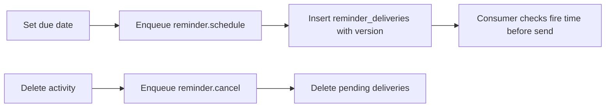
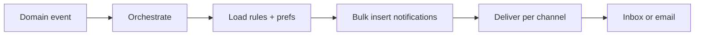

I used to think completion was about content. Then I pulled retention for a cohort. Most learners who stopped did not fail. They just went quiet after a due date passed. No nudge, no follow up. I had built to deliver a course and nothing to bring a learner back.

## Part 1: Nudging without spamming

### What I found
Due dates existed but no job read them. No reminder was scheduled when a due date was set, and none was cancelled when the activity was deleted.

### What I assumed
I assumed a daily cron that scanned due dates would be enough. It would, but it would also wake every learner at midnight, even those whose due date had not changed.

### Where I was exposed
I set a due date, deleted the activity, and got a reminder the next morning for something that no longer existed. The producer had no link to the source, so it could not know the date was stale.

I added a shared `reminder_deliveries` table with `due_date_version`, a `reminder.schedule` producer on publish or update, and a `reminder.cancel` that removes pending rows on delete.



```sql
-- internal/core/db/queries/reminder_deliveries.sql:12
INSERT INTO reminder_deliveries (tenant_id, user_id, due_date, due_date_version, fire_at)
VALUES ($1, $2, $3, $4, $5) ON CONFLICT DO NOTHING
```

**Why not scan every hour?** Scanning is simple but not precise. Versioning ties the reminder to the exact due date. If the date moves, the old row is inert and the new one fires once.

**Result:** A reminder fires once, at the right time, for the right version, and disappears if the work does.

## Part 2: Fanning out notifications once

### What I found
Events fired but did not reach inboxes reliably. One domain event needed to become many notifications, one per learner and per channel, and the old code fanned out in the request. If it timed out, half got notified and half did not.

### What I assumed
I assumed one write per notification was fine. For a cohort of 300, that was 300 writes in a loop, each with its own idempotency key built differently.

### Where I was exposed
I published `assignment_graded` for a cohort and checked the outbox. Half the rows had colliding keys and overwrote each other. The job retried and created duplicates. I had no single key for "this event, this learner, this channel."

I built an orchestration service that reads one domain event and fans out to rules and preferences in bulk, with canonical `metadata.context` and deeplink. Each notification gets a stable idempotency key.

```go
// internal/features/notifications/service/orchestrate.go:88
key := fmt.Sprintf("%s:%d:%d:%s", event.ID, recipientID, tenantID, channel)
// bulk write
_ = repo.BulkInsertNotifications(ctx, rows)
```



**Why not fan out synchronously?** That keeps the request open while 300 inserts run. Orchestration moves it to a job, one event in, many notifications out, with clear retry.

**Result:** A grade update fans out to every learner once, on the right channel, with a link to the exact item.

## Part 3: Seeing who is at risk

### What I found
Teachers could not answer "who is falling behind?" without exporting grades and filtering in a spreadsheet. There was no course health view.

### What I assumed
I assumed grades were enough. They are, but not as a CSV. A headteacher needs to see risk this week, not next term.

### Where I was exposed
I asked a coordinator which students were at risk. She opened three tabs and compared manually. I had the data but no endpoint that joined it.

I added `GET /admin/courses/:id/metrics` and exposed `include_in_course_total`. History now supports `studentId` and email filter so a teacher can search, not scroll.

```go
// internal/features/gradebook/transport/httpx/handler.go:112
// GET /admin/courses/:id/metrics returns totals, at-risk count, recent activity
metrics, _ := s.GetCourseMetrics(ctx, courseID, tenantID)
return c.JSON(200, metrics)
```

**Result:** A teacher opens one page and sees how many learners are behind, who they are, and which item is blocking them. No export, no spreadsheet.

What is still fragile is the copy. We deeplink correctly, but the message is still generic. Next is why this specific learner was nudged, in their language.
