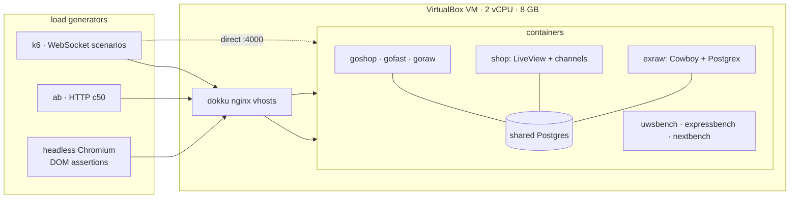

Before rebuilding my main app I wanted numbers instead of folklore. Not synthetic hello-worlds -- the same five workloads my app actually does: render a DB-backed page, serve JSON, take events over WebSockets and write them to Postgres, broadcast to a room, and sit idle holding thousands of connections. Nine stacks, one box, same wire protocols everywhere.

This post stands alone, but it is also the measurement backbone for two deployment-tool write-ups ([OpenShip](/posts/testing-openship-locally/) and [Dokku](/posts/living-with-dokku/)) -- the platforms carried these apps; this post is about the apps themselves.

## The nine stacks

| # | Stack | Layers | Language |
|---|---|---|---|
| 1 | LiveView | Phoenix + LiveView + Bandit + Ecto | Elixir |
| 2 | Raw Phoenix Channels | Phoenix endpoints + channels, no LiveView | Elixir |
| 3 | Raw Cowboy | Cowboy 2.18 + Postgrex only -- BEAM's floor | Elixir |
| 4 | Go net/http | stdlib + coder/websocket + pgx | Go |
| 5 | Go fasthttp | fasthttp + fasthttp/websocket + pgx | Go |
| 6 | Go raw TCP | hand-rolled RFC6455 frames + pgx | Go |
| 7 | Express | express + ws + pg | Node |
| 8 | µWebSockets.js | uWS v20 replaces the HTTP server entirely | Node |
| 9 | Next.js prod | next build standalone + pg pool | Node |

Stacks 2, 3 and 6 exist to answer one question: how much of each language's number is *framework* and how much is *runtime*?

## The rig

Hardware, since every number below lives or dies by it:

| Spec | Value |
|---|---|
| Hypervisor | VirtualBox (via Vagrant), guest co-located with load generators |
| Guest OS | Ubuntu 22.04 (`ubuntu/jammy64`) |
| vCPU | 2 |
| RAM | 8 GB |
| Disk | ~39 GB guest disk |
| Network | host-only `192.168.56.10`; apps behind dokku nginx vhosts |

Method rules that mattered more than any tool choice:

- **Same-window comparisons only.** Mid-session, unrelated host load silently tripled every RTT median (18→183 ms) while VM-side metrics looked perfectly idle. Only numbers taken in the same quiet window are comparable; cross-session gaps of ±40% exist.
- **Every WS claim has a proxied and a direct variant.** Dokku's nginx costs real throughput (below), so both paths were measured.
- **Real browser checks for interactive claims.** Wire probes once passed while the UI was completely frozen (a vendored-JS version skew); headless Chromium clicking buttons is what catches truth here.
- **Identical wire protocols across stacks** for WS: same echo/db/broadcast modes, same 2 KB fan-out payload, same k6 client logic.

## Pages and API

| requests/sec, ab -c50 | page + DB | plain page | JSON API + JOIN |
|---|---|---|---|
| µWebSockets.js | **1660** | 4121 | **1630** |
| LiveView / Bandit | 1348* | – | 564–897 |
| Go fasthttp | 1136 | **4796** | 1398 |
| Go net/http | 811 | 1170 | 562 |
| raw Cowboy † | 398† | 1123 | 356† |
| Express | 296 | 1258 | 452 |
| Next.js prod | 93 | 94 | 171 |

\* same-session pair: `/counter` 1348 vs `/store` (plain Phoenix) 800 -- session variance runs ±40%, so only same-window deltas count.
† raw Cowboy's DB-backed routes ran suspiciously slow after a late refactor; suspected connection-pool sizing issue, listed as a re-bench item below. Its non-DB numbers stand.

Three findings:

1. **µWS owns the generic request path**, fasthttp owns the static-ish one (4796 plain -- Go's deficit was `net/http`, not the language).
2. **Next's bottleneck is rendering, not I/O**: plain SSR ≈ DB SSR (94 vs 93 rps). React RSC serialization is ~7–10× heavier per render than HEEx.
3. **LiveView holds its own against tuned Go** on a stateful page (1348 vs 1136) -- signed sessions and HEEx diffing included.

## WebSocket event → DB write

The workload my app actually lives on: 50 persistent connections, each firing events the server must persist (`UPDATE … RETURNING`) and ack.

| WS→DB, 50 conns | via nginx | median RTT | direct to container | median RTT |
|---|---|---|---|---|
| µWebSockets.js | **1315/s** | 9 ms | – | – |
| Go fasthttp | 1271/s | 12 ms | – | – |
| raw Phoenix Channels | 1076/s | 27 ms | – | – |
| LiveView / Bandit | 659–740/s | 75 ms | 1201/s | 25 ms |
| Go net/http (coder/ws) | 700/s | 33 ms | – | – |
| raw Cowboy † | 670/s | 77 ms | 1398/s | 18 ms |
| Express + ws | 663/s | 23 ms | – | – |
| Go raw TCP (RFC6455) | 754/s | 28 ms | 935/s | 15 ms |

† measured before the late Cowboy refactor; re-verification queued (see TODO).

The interesting rows are the pairs. **The proxy tax is the single biggest lever in the whole exercise**: raw Cowboy drops 1398→670 (2.1×), LiveView 1201→659 (1.8×), and adds 40–50 ms to every median. Before blaming your framework for WS latency, measure what your reverse proxy is doing.

And the framework tax is real too: **LiveView's protocol machinery costs ≈31% versus bare Phoenix Channels** (740 vs 1076/s, same window). That is the price of signed tokens and DOM diffing -- and whether it's worth paying depends entirely on whether you want the diffing.

## Fan-out: everyone ties, and that is the finding

100 connections, publisher broadcasting 2 KB frames:

| stack | delivered msgs/s |
|---|---|
| µWS | 4943 |
| Go raw TCP (direct) | 4942 |
| LiveView PubSub | 4938 |
| raw Cowboy | 4938 |
| Go net/http hub | 4931 |
| Express hub | 4929 |
| raw Phoenix Channels | 4913 |
| Go fasthttp | 4944 |

Seven runtimes, spread of 31 msgs/s (~0.6%). When seven different languages land on the same ceiling, **the ceiling belongs to the box** -- nginx connection limits plus co-located load-generator CPU -- not to any of them. Language choice did not matter here; it will matter again above ~10k concurrent fan-out targets, which this 2-vCPU lab cannot produce.

## Memory

Two different questions hide in "memory". Whole-app floor at idle: Go wins outright (7–13 MiB), BEAM pays a ~100 MiB+ floor for the runtime's features, V8 sits between.

But for a WebSocket app, the number that predicts capacity is **cost per idle connection** (5,000 open sockets, RSS delta ÷ 5000):

µWS's deferred-allocation design gives ~40 bytes per parked client. Extrapolating to six-figure connection counts:

| 100k idle clients | RAM needed |
|---|---|
| µWebSockets.js | ~4 MB |
| Express | ~300 MB |
| raw Cowboy | ~800 MB |
| Go (raw/fasthttp/coder) | 1.1–4.4 GB |
| LiveView | ~2.7 GB |

For a chat/broadcast product holding parked tabs open, that column can pick your stack for you. (Caveat: idle cost ≠ active cost -- once frames flow, buffers converge somewhat.)

One BEAM-specific quirk worth knowing: idle LiveView connections crept from ~27 KB to ~53 KB between the 5k and 10k samples because GC fires on activity, and idle conns only exchange heartbeats. It stabilizes; it just doesn't shrink back eagerly.

## Interference: when workloads collide

Running pgbench writes and HTTP traffic simultaneously on the same box:

| pairing | DB tps | HTTP rps | degradation |
|---|---|---|---|
| Cowboy-era shop | −21% | −21% | symmetric, mild |
| Bandit shop | −60% | −44% | ugly (single sample) |

One sample, grain of salt -- but plausible mechanically: Bandit parses HTTP in pure Elixir and burns CPU under contention, while Cowboy leaned on a C NIF. If your box shares duties (app + DB on one machine), this axis deserves its own test day.

## Scoreboard

| Axis | Winner | Runner-up |
|---|---|---|
| Generic request path | µWS | fasthttp |
| Static/plain rendering | fasthttp (4796) | µWS (4121) |
| WS ingest (proxied) | µWS (1315/s) | fasthttp (1271/s) |
| WS ingest (direct, BEAM floor) | raw Cowboy 1398/s* | Go raw 935/s |
| Cheapest idle conns | µWS (~40 B) | Express (~3 KB) |
| Lowest whole-app RSS | Go net/http (7 MiB) | fasthttp/goraw (8–13 MiB) |
| Fan-out | tie -- box ceiling | everyone |
| Interactive UI economics | LiveView (diffs + sessions free) | – |
| Deploy friction (the hidden axis) | Go/Node single binaries | µWS needs glibc + Node ≥22 |

*pending re-verification after refactor, see below.

## What I'd pick

- **Socket-heavy broadcast app**: µWS if the team tolerates its packaging quirks (glibc-only prebuilts, Node ≥22); fasthttp otherwise. Both leave everything else behind on ingest.
- **Productivity-first, UI-driven app**: Phoenix/LiveView. You pay ~2× memory and a measurable protocol tax, and you get server-rendered interactivity, channels, and one language end to end. The raw-channel result shows the tax buys something specific.
- **Lean API services**: Go -- either flavor. Predictable floors, boring deploys.
- **SSR marketing/catalog surfaces**: Next works, but know that its floor is render-bound; cache aggressively or split static from dynamic.

## Caveats, honestly held

- One 2-vCPU VirtualBox guest shared with the load generators. Absolute numbers are hobby-hardware scale; the *rankings* transferred consistently across every re-test, which is what I was after.
- k6 itself OOMs around 7k VUs in-VM -- ceilings above ~10k connections are loadgen-bound, not app-bound.
- Several numbers are single samples from quiet windows; the host-starvation episode is documented precisely because it nearly poisoned cross-session comparisons.

## TODO -- re-bench queue

- [ ] raw Cowboy WS→DB after the Cowboy ≥2.14 handler-callback migration (both proxied and direct; the 1398/s direct figure predates it)
- [ ] raw Cowboy DB-backed pages (pool-size suspicion behind the 398 rps outlier)
- [ ] fasthttp + goraw WS trio in one clean window for publication-grade medians
