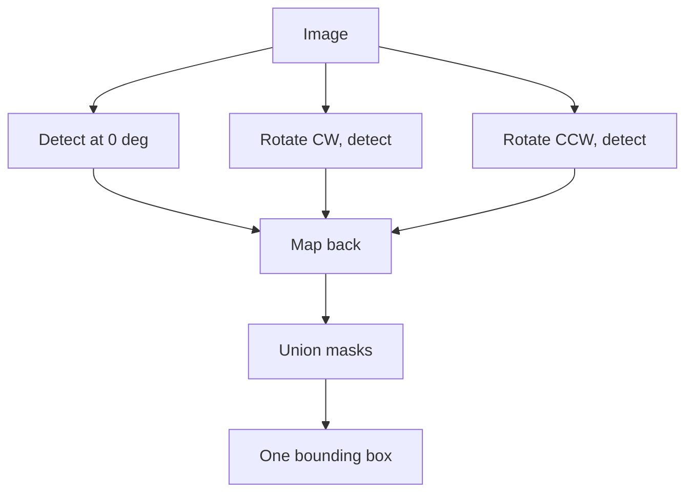

This is part three of four. Part two ended with a new goal and three acceptance criteria: deterministic, auditable, honest. The watermark becomes one uniform translucent rectangle carrying its own color and opacity, and nothing is invented.

What follows is every attempt in the order I tried it, each with why it was tried, what it produced, and where it fell short. A shorter telling of this stretch appeared in [the first rectangle post](/posts/replacing-watermarks-with-a-rectangle/).

## The blend model everything stands on

A semi transparent watermark does not sit on top of a photo. It is blended into it, per pixel:

```python
observed = alpha * color + (1 - alpha) * background
```

For the main site's mark, measurement put alpha near 0.28 with white text. Two consequences drive the whole recipe. First, the mark's own appearance is computable, so a replacement can match it exactly. Second, the background survives dimmed inside every marked pixel, which is both a temptation and a trap that attempt five falls into.

## Attempt 1. The opaque sticker

**Why:** simplest thing that could work. Median color of all masked pixels, fill the bounding box.

**Result:** text gone completely. The recipe ran at detection speed with no model in sight.

**Shortcoming:** zero transparency. On a brown floor the panel was a flat tan sticker. The output failed the "honest" criterion immediately: it looked like an edit hiding something.

## Attempt 2. Measured transparency

**Why:** the blend model makes opacity measurable rather than guessable. Lift over headroom:

```python
alpha = (observed - background) / (255 - background)
```

I computed this over masked pixels across 40 real images and rendered ladders of candidate opacities side by side.

| alpha band | verdict from the ladder |
|---|---|
| 0.40 to 0.70 | original text clearly traceable |
| 0.71 to 0.89 | traceable if you know where to look |
| 0.90 to 0.93 | gone at a glance, faint structure on close inspection |
| **0.94** | **completely unreadable, still reads as a watermark band** |

Measured opacity clustered between 0.26 and 0.31, matching how faint the real marks look, and 0.94 locked as the paint value.

**Shortcoming:** two images in the batch broke it, each differently, and both failures taught more than the successes.

## Attempt 3. Sample the text, not the badge

**Why it failed before fixing:** one site uses two layer marks, a solid purple badge with white text inside. Taking the median of all masked pixels lands on the badge because badges out area letters. Painting purple under white text leaves the letters ghosting through, brighter than their surroundings.

**Fix:** the glyphs are the brightest set under the mask. Sample only them:

```python
bright = px[mask][np.argsort(px[mask].sum(1))[-k:]]
text_color = np.median(bright, axis=0)
```

On the badge image the sampled color moved from purple to near white and the panel stopped fighting the text.

## Attempt 4. Neutralize the strokes before painting

**Why:** painting the text color over pixels containing the text is a no-op. White veil over white strokes is still white. The readable ghost survived until this existed.

**Method:** replace glyph pixels with the median of their 21 pixel neighborhood, guarded so the patch cannot eat the photo:

```python
med = cv2.medianBlur(img, 21)
delta = np.abs(luma(med) - luma(img))
patch = (delta > 15) & (luma(img) < 210)   # skip noise, skip bright windows
img[mask & patch] = med[mask & patch]
```

Flat surfaces give flat medians. Wood gives the local grain tone. Bright saturated areas are skipped because the veil alone already hides anything there.

## Attempt 5. Exact inversion, the elegant dead end

**Why:** the blend equation rearranges. If per pixel alpha were known, the true background comes back exactly, grain included, no reconstruction:

```python
background = (observed - alpha * 255) / (1 - alpha)
```

**Result:** dark streaks and amplified noise. Division by `(1 - alpha)` magnifies any error in alpha by up to about 30 times. A 0.03 error becomes a visible gouge, and JPEG compression guarantees such errors.

**Shortcoming:** exact math on estimated inputs produces confidently wrong pixels. Dropped without regret; it later earned a second life as a benchmark challenger.

## Attempt 6. Rotations for vertical marks

**Why:** one site stamps vertically down furniture and plain detection caught half of it.

**Method:** detect on the image rotated 90 degrees each way, map masks back, union everything:



The union covers the full strip. This step exists entirely because of one wardrobe photo.

## Attempt 7. Locking the recipe

Everything above assembled into five steps: detect three times and union, dilate by 5 for the box plus 8 padding, sample text color from the brightest 20 percent, neutralize strokes with the guarded patch, paint one constant rectangle at 0.94. Every parameter traces to a specific failure. Nothing is a default someone picked.

Porting it into the production tool surfaced four bugs worth naming because each produced wrong output that looked right:

1. **Silent CPU fallback.** Models loaded onto CPU through an unresolved device string. Everything worked at one eighth speed.
2. **Channel swap.** OpenCV BGR arrays saved through an RGB assuming path. Red and blue exchanged everywhere, invisible on beige interiors, fatal for blue skies.
3. **The pool that hangs.** One multiprocessing worker died quietly and the pool waited forever. Detection now runs in-process.
4. **Dilated mask leak.** Color sampled from the dilated mask instead of the raw one shifted results on most test images.

## Every attempt side by side

First, the machines, because every image operation attempt spends nearly all its time inside the YOLO detector and inherits the same throughput curve:

| hardware | VRAM | class | recipe throughput | what changes |
|---|---|---|---|---|
| CPU only, 20 cores | n/a | the accident | 0.25 img/s (measured) | how the silent fallback ran |
| RTX 4070 laptop | 8 GB | baseline, all measurements here | 2.0 to 2.3 img/s (measured) | fits entirely, no crops |
| RX 7900 XTX | 24 GB | consumer AMD | ~2 to 2.5 img/s (est.) | works through ROCm after setup tax |
| RTX 4090 | 24 GB | Ada consumer | ~2.5 to 3 img/s (est.) | detector faster, CPU floor takes over |
| L40S | 48 GB | Ada datacenter | ~2.5 to 3 img/s (est.) | same ceiling, you pay for idle VRAM |
| A100 | 80 GB | Ampere datacenter | ~2.5 to 3 img/s (est.) | no benefit, detector never gets large |
| H100 | 80 GB | Hopper datacenter | ~2.5 to 3 img/s (est.) | no benefit on this workload |
| RTX 5090 | 32 GB | Blackwell consumer | ~2.5 to 3 img/s (est.) | same CPU bound ceiling |

The flattening above roughly 2.5 images per second is not GPU weakness, it is JPEG decode, preprocessing, and OpenCV work on the host. Beyond a 4090 class card the pipeline is CPU bound, which is why datacenter cards buy nothing here. The 24 GB and up tier only earns its price on the diffusion challengers in [part four](/posts/what-the-rectangle-could-not-beat/).

Now the iterations themselves. The repository holds forty five attempt directories across ten families, every rectangle iteration gets its own row, and both tables below are generated from the same facts viewed two ways.

**Every attempt in trial order**, oldest first, dated by folder creation time:

| tried | iteration | name | what it tested | visual result |
|---|---|---|---|---|
| Aug 22 | `clean_v5`, `clean_v1`, `clean_v2`, `clean_v4` | The Inpainting Runs | LaMa pipeline generations on this corpus | clean walls, invented window fills |
| Aug 23 | `morph`, `morph_v2`, `morph_simple` | The Probes | morphology alone to isolate marks | masks too ragged to build on |
| Aug 23 | `morph_transparent` | The Transparent Probe | soft alpha edges on those masks | halos everywhere |
| Aug 23 | `replicate` | The Template Check | cross image alpha template stability | templates too noisy to trust |
| Aug 23 | `unmix` | The Decomposition Try | UNMIX style layer separation | unusable at JPEG quality |
| Aug 23 | `rect_algo/v01` to `v03` | The Geometry Sketches | hand drawn rectangle placement rules | boxes drifted off the marks |
| Aug 23 | `rect_algo/v04_tri` | The Triangle Rule | triangular coverage heuristics | overcovers, eats photo edges |
| Aug 23 | `rect_algo/v05_round` | The Rounded Panel | softer rectangle aesthetics | looked nice, still missed verticals |
| Aug 23 | `rect_algo/v06_user_script` | The Borrowed Script | a community script's geometry | wrong color basis for these stamps |
| Aug 23 | `rect_algo/v07_glyph_masks` | Glyph First | paint per glyph box instead of union | choppy panels, seams between letters |
| Aug 23 | `simple_morph_t/v01` to `v07` | The Opaque Sticker era | median fill, seven tuning rounds | text gone, looks pasted on |
| Aug 23 | `simple_morph_t/v08_simple_transparent` | First Transparency | blend instead of fill | right idea, rough color |
| Aug 23 | `exact_invert/v01_flat` | Flat Alpha Inversion | one alpha everywhere | streaks from edge pixels |
| Aug 23 | `exact_invert/v02_perpixel` | Per Pixel Inversion | template derived alpha map | noise amplified up to 30 times |
| Aug 23 | `template_match_lama/v01` | The Hybrid, First Pass | template match plus LaMa on strokes | promising on flat marks only |
| Aug 23 | `simple_morph_t/v09_one_color` | One Color Panel | single constant color per mark | uniform, but opacity unsolved |
| Aug 23 | `simple_morph_t/v10_alpha_ladder` | The Ladder, Part One | opacities 0.40 to 0.85 side by side | below 0.90 always traceable |
| Aug 23 | `simple_morph_t/v11_alpha_ladder` | The Ladder, Part Two | opacities 0.86 to 1.00 | 0.94 chosen, locked forever |
| Aug 24 | `simple_morph_t/v12_batch40_a94` | The Forty | first full 40 image batch at 0.94 | exposed badge ghost and half detected verticals |
| Aug 24 | `simple_morph_t/v13_batch40_a94_v2` | The Glyph Sampler | brightest 20 percent text color | badge case fixed |
| Aug 24 | `simple_morph_t/v14_batch40_a94_v2` | The Locked Recipe | rotations, sampler, patch, 0.94 | deliberate band, all failures closed |
| Aug 24 | `simple_morph_t/v15_fast3_a94` | The Speed Check | locked recipe timing on 3 images | 2.0 to 2.3 img/s confirmed |
| Aug 24 | `manual_clean/v01` to `v06` | The Hand Builds | per failure image manual recipes | proved each fix, no automation yet |
| Aug 24 | `manual_clean/v07_invert_a28` | Inversion by Hand | inversion at measured alpha 0.28 | dark streaks again |
| Aug 24 | `template_match_lama/v02_reddit` | The Hybrid, Reddit Rules | community matching rules added | best attempt on wood grain |
| Aug 24 | `brushnet/v01` | The Diffusion Challenger | BrushNet local, 512 crops | lost all three comparisons |
| Aug 25 | `simple_morph_t/v16_batch40_a94_v2` | The Production Proof | stream_clean port, pixel matched | max diff 0.81, JPEG rounding only |

**The same attempts ranked by success**, best first:

| rank | iteration | name | why it ranks here |
|---|---|---|---|
| 1 | `simple_morph_t/v16_batch40_a94_v2` | The Production Proof | validated port, pixel identical to recipe outputs |
| 2 | `simple_morph_t/v14_batch40_a94_v2` | The Locked Recipe | closed every failure, became the default |
| 3 | `simple_morph_t/v15_fast3_a94` | The Speed Check | confirmed 2.0 to 2.3 img/s without quality loss |
| 4 | `template_match_lama/v02_reddit` | The Hybrid, Reddit Rules | best result ever achieved on wood grain |
| 5 | `simple_morph_t/v13_batch40_a94_v2` | The Glyph Sampler | killed the badge ghost |
| 6 | `simple_morph_t/v11_alpha_ladder` | The Ladder, Part Two | produced the permanent 0.94 |
| 7 | `simple_morph_t/v10_alpha_ladder` | The Ladder, Part One | narrowed opacity to a band |
| 8 | `simple_morph_t/v12_batch40_a94` | The Forty | failed honestly, and named exactly what to fix |
| 9 | `manual_clean/v01` to `v06` | The Hand Builds | each fix proven before automation |
| 10 | `simple_morph_t/v09_one_color` | One Color Panel | uniform panels, opacity unsolved |
| 11 | `simple_morph_t/v08_simple_transparent` | First Transparency | right direction, rough execution |
| 12 | `clean_v1` to `clean_v5` | The Inpainting Runs | worked mechanically, trust ceiling |
| 13 | `replicate` | The Template Check | clean negative result, saved future work |
| 14 | `rect_algo/v01` to `v07` | The Geometry Family | taught box placement the hard way |
| 15 | `brushnet/v01` | The Diffusion Challenger | lost every comparison at 20x cost |
| 16 | `morph` to `morph_transparent` | The Probes | ragged masks, dead end confirmed cheaply |
| 17 | `exact_invert/v01`, `v02`, `manual_clean/v07` | The Inversion Family | worst kind of failure, confidently wrong pixels |

Both tables describe the same forty five directories. Every attempt was free in money because none rented anything; the only currencies spent were days and disk. Quality improvements across the middle rows were free upgrades too: the jump from sticker to locked recipe changed the pixels completely without changing the bill, and no hardware from the ladder above moves any row except BrushNet's.

## Validation

The locked recipe processed 40 real listing images at 2.0 to 2.3 images per second, roughly four times the inpainting pipeline it replaced. Pixel comparison against the reference batch showed a maximum mean difference of 0.81, which is JPEG encoder rounding between different encoders. Zero images exceeded it.

That settles whether the recipe works. Whether it is good enough against outside competition is part four.

Next: [What the rectangle could not beat](/posts/what-the-rectangle-could-not-beat/).
