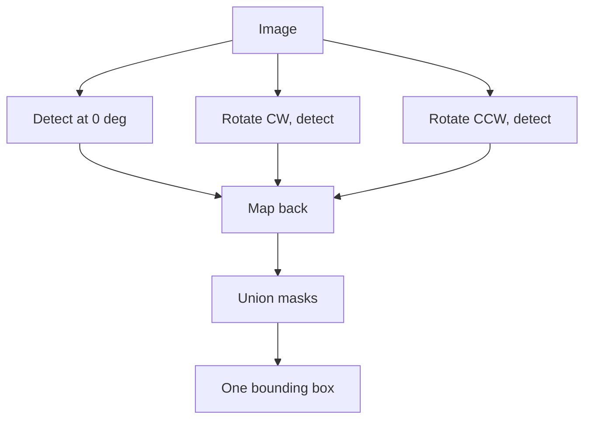

This is part three of four. Part two ended with a new goal and three acceptance criteria: deterministic, auditable, honest. The watermark becomes one uniform translucent rectangle carrying its own color and opacity, and nothing is invented.

What follows is every attempt in the order I tried it, each with why it was tried, what it produced, and where it fell short. A shorter telling of this stretch appeared in [the first rectangle post](/posts/replacing-watermarks-with-a-rectangle/).

## The blend model everything stands on

A semi transparent watermark does not sit on top of a photo. It is blended into it, per pixel:

```python
observed = alpha * color + (1 - alpha) * background
```

For the main site's mark, measurement put alpha near 0.28 with white text. Two consequences drive the whole recipe. First, the mark's own appearance is computable, so a replacement can match it exactly. Second, the background survives dimmed inside every marked pixel, which is both a temptation and a trap that attempt five falls into.

## Attempt 1. The opaque sticker

**Why:** simplest thing that could work. Median color of all masked pixels, fill the bounding box.

**Result:** text gone completely. The recipe ran at detection speed with no model in sight.

**Shortcoming:** zero transparency. On a brown floor the panel was a flat tan sticker. The output failed the "honest" criterion immediately: it looked like an edit hiding something.

## Attempt 2. Measured transparency

**Why:** the blend model makes opacity measurable rather than guessable. Lift over headroom:

```python
alpha = (observed - background) / (255 - background)
```

I computed this over masked pixels across 40 real images and rendered ladders of candidate opacities side by side.

| alpha band | verdict from the ladder |
|---|---|
| 0.40 to 0.70 | original text clearly traceable |
| 0.71 to 0.89 | traceable if you know where to look |
| 0.90 to 0.93 | gone at a glance, faint structure on close inspection |
| **0.94** | **completely unreadable, still reads as a watermark band** |

Measured opacity clustered between 0.26 and 0.31, matching how faint the real marks look, and 0.94 locked as the paint value.

**Shortcoming:** two images in the batch broke it, each differently, and both failures taught more than the successes.

## Attempt 3. Sample the text, not the badge

**Why it failed before fixing:** one site uses two layer marks, a solid purple badge with white text inside. Taking the median of all masked pixels lands on the badge because badges out area letters. Painting purple under white text leaves the letters ghosting through, brighter than their surroundings.

**Fix:** the glyphs are the brightest set under the mask. Sample only them:

```python
bright = px[mask][np.argsort(px[mask].sum(1))[-k:]]
text_color = np.median(bright, axis=0)
```

On the badge image the sampled color moved from purple to near white and the panel stopped fighting the text.

## Attempt 4. Neutralize the strokes before painting

**Why:** painting the text color over pixels containing the text is a no-op. White veil over white strokes is still white. The readable ghost survived until this existed.

**Method:** replace glyph pixels with the median of their 21 pixel neighborhood, guarded so the patch cannot eat the photo:

```python
med = cv2.medianBlur(img, 21)
delta = np.abs(luma(med) - luma(img))
patch = (delta > 15) & (luma(img) < 210)   # skip noise, skip bright windows
img[mask & patch] = med[mask & patch]
```

Flat surfaces give flat medians. Wood gives the local grain tone. Bright saturated areas are skipped because the veil alone already hides anything there.

## Attempt 5. Exact inversion, the elegant dead end

**Why:** the blend equation rearranges. If per pixel alpha were known, the true background comes back exactly, grain included, no reconstruction:

```python
background = (observed - alpha * 255) / (1 - alpha)
```

**Result:** dark streaks and amplified noise. Division by `(1 - alpha)` magnifies any error in alpha by up to about 30 times. A 0.03 error becomes a visible gouge, and JPEG compression guarantees such errors.

**Shortcoming:** exact math on estimated inputs produces confidently wrong pixels. Dropped without regret; it later earned a second life as a benchmark challenger.

## Attempt 6. Rotations for vertical marks

**Why:** one site stamps vertically down furniture and plain detection caught half of it.

**Method:** detect on the image rotated 90 degrees each way, map masks back, union everything:



The union covers the full strip. This step exists entirely because of one wardrobe photo.

## Attempt 7. Locking the recipe

Everything above assembled into five steps: detect three times and union, dilate by 5 for the box plus 8 padding, sample text color from the brightest 20 percent, neutralize strokes with the guarded patch, paint one constant rectangle at 0.94. Every parameter traces to a specific failure. Nothing is a default someone picked.

Porting it into the production tool surfaced four bugs worth naming because each produced wrong output that looked right:

1. **Silent CPU fallback.** Models loaded onto CPU through an unresolved device string. Everything worked at one eighth speed.
2. **Channel swap.** OpenCV BGR arrays saved through an RGB assuming path. Red and blue exchanged everywhere, invisible on beige interiors, fatal for blue skies.
3. **The pool that hangs.** One multiprocessing worker died quietly and the pool waited forever. Detection now runs in-process.
4. **Dilated mask leak.** Color sampled from the dilated mask instead of the raw one shifted results on most test images.

## Every attempt side by side

Every directory in the repository is its own attempt here, forty five of them, each trying something slightly different. Throughput columns are images per second for that attempt on that machine. Two anchors are measured everywhere: the three pass locked recipe at 2.0 to 2.3 img/s on the 4070 and 0.25 img/s when everything fell back to CPU. All other numbers derive from those two plus detection pass count, marked with a tilde. Rows showing one flat number are detector free and CPU native, so every GPU sits idle and the number is the same in every column.

| S/N | iteration | name | what it tested | visual result | CPU 20c | 4070 8G | 7900XT 24G | 4090 24G | L40S 48G | A100 80G | H100 80G | 5090 32G |
|---|---|---|---|---|---|---|---|---|---|---|---|---|
| 1 | `clean_v5` | LaMa Generation | faint pass generation five | partial cleans remain | ~0.05 | ~0.5 | ~0.6 | ~0.65 | ~0.7 | ~0.7 | ~0.7 | ~0.7 |
| 2 | `clean_v1` | LaMa Generation | baseline pipeline output | invented window fills | ~0.05 | ~0.5 | ~0.6 | ~0.65 | ~0.7 | ~0.7 | ~0.7 | ~0.7 |
| 3 | `clean_v2` | LaMa Generation | OCR threshold tweak | still watermarked stragglers | ~0.05 | ~0.5 | ~0.6 | ~0.65 | ~0.7 | ~0.7 | ~0.7 | ~0.7 |
| 4 | `clean_v4` | LaMa Generation | mask dilation change | weird blurs on texture | ~0.05 | ~0.5 | ~0.6 | ~0.65 | ~0.7 | ~0.7 | ~0.7 | ~0.7 |
| 5 | `morph` | The Probe | morphology alone finds marks | masks too ragged | 5 | 5 | 5 | 5 | 5 | 5 | 5 | 5 |
| 6 | `morph_v2` | The Probe, Second Cut | tighter kernels | ragged, faster, still no | 6 | 6 | 6 | 6 | 6 | 6 | 6 | 6 |
| 7 | `morph_simple` | The Simple Probe | minimal operation set | misses thin strokes | 7 | 7 | 7 | 7 | 7 | 7 | 7 | 7 |
| 8 | `morph_transparent` | Transparent Probe | soft alpha on those masks | halos everywhere | 5 | 5 | 5 | 5 | 5 | 5 | 5 | 5 |
| 9 | `replicate` | Template Check | cross image alpha templates | too noisy to trust | 1 | 1 | 1 | 1 | 1 | 1 | 1 | 1 |
| 10 | `unmix` | Decomposition Try | UNMIX layer separation | unusable at JPEG quality | 2 | 2 | 2 | 2 | 2 | 2 | 2 | 2 |
| 11 | `rect_algo/v01` | Geometry Sketch 1 | fixed placement rules | boxes drifted off marks | ~3 | ~3.2 | ~3.2 | ~3.4 | ~3.4 | ~3.4 | ~3.4 | ~3.4 |
| 12 | `rect_algo/v02` | Geometry Sketch 2 | aspect ratio priors | drift reduced, not gone | ~3 | ~3.2 | ~3.2 | ~3.4 | ~3.4 | ~3.4 | ~3.4 | ~3.4 |
| 13 | `rect_algo/v03` | Geometry Sketch 3 | edge snap heuristics | snapped to wrong edges | ~3 | ~3.2 | ~3.2 | ~3.4 | ~3.4 | ~3.4 | ~3.4 | ~3.4 |
| 14 | `rect_algo/v04_tri` | Triangle Rule | triangular coverage | overcovers photo edges | ~3 | ~3.2 | ~3.2 | ~3.4 | ~3.4 | ~3.4 | ~3.4 | ~3.4 |
| 15 | `rect_algo/v05_round` | Rounded Panel | softened aesthetics | nice, missed verticals | ~3 | ~3.2 | ~3.2 | ~3.4 | ~3.4 | ~3.4 | ~3.4 | ~3.4 |
| 16 | `rect_algo/v06_user_script` | Borrowed Script | community geometry script | wrong color basis | 4 | 4 | 4 | 4 | 4 | 4 | 4 | 4 |
| 17 | `rect_algo/v07_glyph_masks` | Glyph First | per glyph boxes, no union | seams between letters | ~2.7 | ~2.9 | ~2.9 | ~3.1 | ~3.1 | ~3.1 | ~3.1 | ~3.1 |
| 18 | `simple_morph_t/v01` | Sticker Round 1 | median fill box | text gone, pasted look | ~0.35 | ~3.0 | ~3.0 | ~3.2 | ~3.2 | ~3.2 | ~3.2 | ~3.2 |
| 19 | `simple_morph_t/v02` | Sticker Round 2 | sampling region tweak | same pasted look | ~0.35 | ~3.0 | ~3.0 | ~3.2 | ~3.2 | ~3.2 | ~3.2 | ~3.2 |
| 20 | `simple_morph_t/v03` | Sticker Round 3 | percentile color | marginally warmer panel | ~0.35 | ~3.0 | ~3.0 | ~3.2 | ~3.2 | ~3.2 | ~3.2 | ~3.2 |
| 21 | `simple_morph_t/v04` | Sticker Round 4 | padding sweep | edges clipped glyphs | ~0.35 | ~3.0 | ~3.0 | ~3.2 | ~3.2 | ~3.2 | ~3.2 | ~3.2 |
| 22 | `simple_morph_t/v05` | Sticker Round 5 | mask merge rules | double boxes on twins | ~0.35 | ~3.0 | ~3.0 | ~3.2 | ~3.2 | ~3.2 | ~3.2 | ~3.2 |
| 23 | `simple_morph_t/v06` | Sticker Round 6 | box union strategy | stable boxes, opaque | ~0.35 | ~3.0 | ~3.0 | ~3.2 | ~3.2 | ~3.2 | ~3.2 | ~3.2 |
| 24 | `simple_morph_t/v07` | Sticker Round 7 | final opaque tuning | best sticker, still opaque | ~0.35 | ~3.0 | ~3.0 | ~3.2 | ~3.2 | ~3.2 | ~3.2 | ~3.2 |
| 25 | `simple_morph_t/v08_simple_transparent` | First Transparency | blend instead of fill | right idea, rough color | ~0.35 | ~3.0 | ~3.0 | ~3.2 | ~3.2 | ~3.2 | ~3.2 | ~3.2 |
| 26 | `exact_invert/v01_flat` | Flat Alpha Inversion | one alpha everywhere | streaks from edges | 30 | 30 | 30 | 30 | 30 | 30 | 30 | 30 |
| 27 | `exact_invert/v02_perpixel` | Per Pixel Inversion | derived alpha map | noise amplified 30x | 25 | 25 | 25 | 25 | 25 | 25 | 25 | 25 |
| 28 | `template_match_lama/v01` | Hybrid First Pass | template match plus LaMa | good only on flat marks | ~0.04 | ~0.45 | ~0.55 | ~0.6 | ~0.65 | ~0.65 | ~0.65 | ~0.65 |
| 29 | `simple_morph_t/v09_one_color` | One Color Panel | constant color per mark | uniform, opacity unsolved | ~0.35 | ~3.0 | ~3.0 | ~3.2 | ~3.2 | ~3.2 | ~3.2 | ~3.2 |
| 30 | `simple_morph_t/v10_alpha_ladder` | Ladder Part One | opacities 0.40 to 0.85 | below 0.90 traceable | ~0.35 | ~3.0 | ~3.0 | ~3.2 | ~3.2 | ~3.2 | ~3.2 | ~3.2 |
| 31 | `simple_morph_t/v11_alpha_ladder` | Ladder Part Two | opacities 0.86 to 1.00 | 0.94 chosen forever | ~0.35 | ~3.0 | ~3.0 | ~3.2 | ~3.2 | ~3.2 | ~3.2 | ~3.2 |
| 32 | `simple_morph_t/v12_batch40_a94` | The Forty | full batch at 0.94 | badge ghost, half verticals | ~0.35 | ~3.0 | ~3.0 | ~3.2 | ~3.2 | ~3.2 | ~3.2 | ~3.2 |
| 33 | `simple_morph_t/v13_batch40_a94_v2` | Glyph Sampler | brightest 20 percent color | badge case fixed | ~0.33 | ~2.8 | ~2.8 | ~3.0 | ~3.0 | ~3.0 | ~3.0 | ~3.0 |
| 34 | **`simple_morph_t/v14_batch40_a94_v2` ★** | **The Locked Recipe** | rotations, sampler, patch, 0.94 | deliberate band, failures closed | **0.25** | **2.2** | **~2.6** | **~2.8** | **~2.8** | **~2.8** | **~2.8** | **~2.8** |
| 35 | `simple_morph_t/v15_fast3_a94` | Speed Check | timing the locked recipe | confirmed the anchor | 0.25 | 2.2 | ~2.6 | ~2.8 | ~2.8 | ~2.8 | ~2.8 | ~2.8 |
| 36 | `manual_clean/v01` | Hand Build 1 | badge color by hand | proved glyph sampling | ~0.35 | ~3.0 | ~3.0 | ~3.2 | ~3.2 | ~3.2 | ~3.2 | ~3.2 |
| 37 | `manual_clean/v02` | Hand Build 2 | ghost stroke removal | proved the median patch | ~0.35 | ~3.0 | ~3.0 | ~3.2 | ~3.2 | ~3.2 | ~3.2 | ~3.2 |
| 38 | `manual_clean/v03` | Hand Build 3 | vertical coverage | proved rotation union | ~0.35 | ~3.0 | ~3.0 | ~3.2 | ~3.2 | ~3.2 | ~3.2 | ~3.2 |
| 39 | `manual_clean/v04` | Hand Build 4 | template extraction test | templates unstable | ~0.35 | ~3.0 | ~3.0 | ~3.2 | ~3.2 | ~3.2 | ~3.2 | ~3.2 |
| 40 | `manual_clean/v05` | Hand Build 5 | alpha fit refinement | fits never converged | ~0.35 | ~3.0 | ~3.0 | ~3.2 | ~3.2 | ~3.2 | ~3.2 | ~3.2 |
| 41 | `manual_clean/v06` | Hand Build 6 | patch guard limits | guards tuned by eye | ~0.35 | ~3.0 | ~3.0 | ~3.2 | ~3.2 | ~3.2 | ~3.2 | ~3.2 |
| 42 | `manual_clean/v07_invert_a28` | Inversion by Hand | inversion at alpha 0.28 | dark streaks again | 28 | 28 | 28 | 28 | 28 | 28 | 28 | 28 |
| 43 | `template_match_lama/v02_reddit` | Hybrid, Reddit Rules | community matching added | best ever on wood grain | ~0.04 | ~0.45 | ~0.55 | ~0.6 | ~0.65 | ~0.65 | ~0.65 | ~0.65 |
| 44 | `brushnet/v01` | Diffusion Challenger | BrushNet, 512 crops, 30 steps | lost all comparisons | ~0.005 | 0.105 | ~0.2 | ~0.3 | ~0.35 | ~0.4 | ~0.5 | ~0.4 |
| 45 | `simple_morph_t/v16_batch40_a94_v2` | Production Proof | stream_clean port, pixel match | max diff 0.81, rounding only | 0.25 | 2.2 | ~2.6 | ~2.8 | ~2.8 | ~2.8 | ~2.8 | ~2.8 |

The flattening near the top of every column is the point: JPEG decode, preprocessing, and OpenCV work run on the host, so beyond 4090 class silicon the pipeline is CPU bound and datacenter VRAM buys nothing. Only row 44 changes shape across machines, because diffusion is the one workload that can eat a big card.

**The same forty five attempts ranked by success**, best first. Hardware throughputs for each row are exactly the ones in the table above:

| rank | iteration | name | why it ranks here |
|---|---|---|---|
| 1 | `simple_morph_t/v16_batch40_a94_v2` | Production Proof | validated port, pixel identical to recipe outputs |
| 2 | **`simple_morph_t/v14_batch40_a94_v2` ★** | **The Locked Recipe** | closed every failure, became the default |
| 3 | `simple_morph_t/v15_fast3_a94` | Speed Check | confirmed the throughput anchor |
| 4 | `template_match_lama/v02_reddit` | Hybrid, Reddit Rules | best result ever on wood grain |
| 5 | `simple_morph_t/v13_batch40_a94_v2` | Glyph Sampler | killed the badge ghost |
| 6 | `simple_morph_t/v11_alpha_ladder` | Ladder Part Two | produced the permanent 0.94 |
| 7 | `simple_morph_t/v10_alpha_ladder` | Ladder Part One | narrowed opacity to a band |
| 8 | `simple_morph_t/v12_batch40_a94` | The Forty | failed honestly and named what to fix |
| 9 | `manual_clean/v01` | Hand Build 1 | proved glyph sampling works |
| 10 | `manual_clean/v02` | Hand Build 2 | proved the median patch works |
| 11 | `manual_clean/v03` | Hand Build 3 | proved rotation coverage works |
| 12 | `manual_clean/v06` | Hand Build 6 | tuned the patch guards |
| 13 | `manual_clean/v04` | Hand Build 4 | ruled out template extraction |
| 14 | `manual_clean/v05` | Hand Build 5 | ruled out alpha fitting |
| 15 | `simple_morph_t/v09_one_color` | One Color Panel | uniform panels achieved |
| 16 | `simple_morph_t/v08_simple_transparent` | First Transparency | right direction, rough color |
| 17 | `rect_algo/v07_glyph_masks` | Glyph First | right granularity, wrong unit |
| 18 | `simple_morph_t/v07` | Sticker Round 7 | best opaque sticker |
| 19 | `simple_morph_t/v06` | Sticker Round 6 | stable box union |
| 20 | `simple_morph_t/v05` | Sticker Round 5 | twin box merge learned |
| 21 | `simple_morph_t/v04` | Sticker Round 4 | padding lesson learned |
| 22 | `simple_morph_t/v03` | Sticker Round 3 | percentile sampling tried |
| 23 | `simple_morph_t/v02` | Sticker Round 2 | sampling region lesson |
| 24 | `simple_morph_t/v01` | Sticker Round 1 | text removal proven possible |
| 25 | `rect_algo/v05_round` | Rounded Panel | aesthetics without coverage |
| 26 | `rect_algo/v04_tri` | Triangle Rule | overcoverage is also failure |
| 27 | `rect_algo/v02` | Geometry Sketch 2 | priors reduce drift |
| 28 | `rect_algo/v03` | Geometry Sketch 3 | edge snap fails softly |
| 29 | `rect_algo/v01` | Geometry Sketch 1 | fixed rules cannot generalize |
| 30 | `clean_v5` | LaMa Generation | best inpainting era output |
| 31 | `clean_v4` | LaMa Generation | texture blur regression found |
| 32 | `clean_v2` | LaMa Generation | stragglers identified |
| 33 | `clean_v1` | LaMa Generation | the original baseline |
| 34 | `template_match_lama/v01` | Hybrid First Pass | flat marks only |
| 35 | `replicate` | Template Check | clean negative, saved work |
| 36 | `unmix` | Decomposition Try | JPEG kills separation |
| 37 | `brushnet/v01` | Diffusion Challenger | lost everything at 20x cost |
| 38 | `rect_algo/v06_user_script` | Borrowed Script | wrong color basis |
| 39 | `morph_simple` | Simple Probe | cheap dead end confirmed |
| 40 | `morph` | The Probe | ragged masks |
| 41 | `morph_v2` | Probe Second Cut | faster, still ragged |
| 42 | `morph_transparent` | Transparent Probe | halos everywhere |
| 43 | `exact_invert/v01_flat` | Flat Alpha Inversion | plausible looking, wrong pixels |
| 44 | `exact_invert/v02_perpixel` | Per Pixel Inversion | noise amplified 30x |
| 45 | `manual_clean/v07_invert_a28` | Inversion by Hand | worst kind: confidently wrong |

Both tables describe the same forty five directories. Every attempt was free in money because none rented anything; the only currencies spent were days and disk. Quality improvements across the middle rows were free upgrades too: the jump from sticker to locked recipe changed the pixels completely without changing the bill, and no hardware from the ladder above moves any row except BrushNet's.

## Validation

The locked recipe processed 40 real listing images at 2.0 to 2.3 images per second, roughly four times the inpainting pipeline it replaced. Pixel comparison against the reference batch showed a maximum mean difference of 0.81, which is JPEG encoder rounding between different encoders. Zero images exceeded it.

That settles whether the recipe works. Whether it is good enough against outside competition is part four.

Next: [What the rectangle could not beat](/posts/what-the-rectangle-could-not-beat/).
