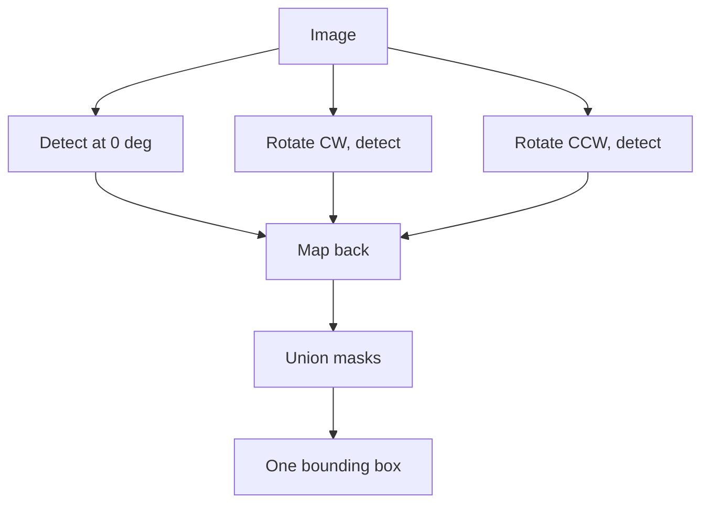

This is part three of four. Part two ended with a new goal and three acceptance criteria: deterministic, auditable, honest. The watermark becomes one uniform translucent rectangle carrying its own color and opacity, and nothing is invented.

What follows is every attempt in the order I tried it, each with why it was tried, what it produced, and where it fell short. A shorter telling of this stretch appeared in [the first rectangle post](/posts/replacing-watermarks-with-a-rectangle/).

## The blend model everything stands on

A semi transparent watermark does not sit on top of a photo. It is blended into it, per pixel:

```python
observed = alpha * color + (1 - alpha) * background
```

For the main site's mark, measurement put alpha near 0.28 with white text. Two consequences drive the whole recipe. First, the mark's own appearance is computable, so a replacement can match it exactly. Second, the background survives dimmed inside every marked pixel, which is both a temptation and a trap that attempt five falls into.

## Attempt 1. The opaque sticker

**Why:** simplest thing that could work. Median color of all masked pixels, fill the bounding box.

**Result:** text gone completely. The recipe ran at detection speed with no model in sight.

**Shortcoming:** zero transparency. On a brown floor the panel was a flat tan sticker. The output failed the "honest" criterion immediately: it looked like an edit hiding something.

## Attempt 2. Measured transparency

**Why:** the blend model makes opacity measurable rather than guessable. Lift over headroom:

```python
alpha = (observed - background) / (255 - background)
```

I computed this over masked pixels across 40 real images and rendered ladders of candidate opacities side by side.

| alpha band | verdict from the ladder |
|---|---|
| 0.40 to 0.70 | original text clearly traceable |
| 0.71 to 0.89 | traceable if you know where to look |
| 0.90 to 0.93 | gone at a glance, faint structure on close inspection |
| **0.94** | **completely unreadable, still reads as a watermark band** |

Measured opacity clustered between 0.26 and 0.31, matching how faint the real marks look, and 0.94 locked as the paint value.

**Shortcoming:** two images in the batch broke it, each differently, and both failures taught more than the successes.

## Attempt 3. Sample the text, not the badge

**Why it failed before fixing:** one site uses two layer marks, a solid purple badge with white text inside. Taking the median of all masked pixels lands on the badge because badges out area letters. Painting purple under white text leaves the letters ghosting through, brighter than their surroundings.

**Fix:** the glyphs are the brightest set under the mask. Sample only them:

```python
bright = px[mask][np.argsort(px[mask].sum(1))[-k:]]
text_color = np.median(bright, axis=0)
```

On the badge image the sampled color moved from purple to near white and the panel stopped fighting the text.

## Attempt 4. Neutralize the strokes before painting

**Why:** painting the text color over pixels containing the text is a no-op. White veil over white strokes is still white. The readable ghost survived until this existed.

**Method:** replace glyph pixels with the median of their 21 pixel neighborhood, guarded so the patch cannot eat the photo:

```python
med = cv2.medianBlur(img, 21)
delta = np.abs(luma(med) - luma(img))
patch = (delta > 15) & (luma(img) < 210)   # skip noise, skip bright windows
img[mask & patch] = med[mask & patch]
```

Flat surfaces give flat medians. Wood gives the local grain tone. Bright saturated areas are skipped because the veil alone already hides anything there.

## Attempt 5. Exact inversion, the elegant dead end

**Why:** the blend equation rearranges. If per pixel alpha were known, the true background comes back exactly, grain included, no reconstruction:

```python
background = (observed - alpha * 255) / (1 - alpha)
```

**Result:** dark streaks and amplified noise. Division by `(1 - alpha)` magnifies any error in alpha by up to about 30 times. A 0.03 error becomes a visible gouge, and JPEG compression guarantees such errors.

**Shortcoming:** exact math on estimated inputs produces confidently wrong pixels. Dropped without regret; it later earned a second life as a benchmark challenger.

## Attempt 6. Rotations for vertical marks

**Why:** one site stamps vertically down furniture and plain detection caught half of it.

**Method:** detect on the image rotated 90 degrees each way, map masks back, union everything:



The union covers the full strip. This step exists entirely because of one wardrobe photo.

## Attempt 7. Locking the recipe

Everything above assembled into five steps: detect three times and union, dilate by 5 for the box plus 8 padding, sample text color from the brightest 20 percent, neutralize strokes with the guarded patch, paint one constant rectangle at 0.94. Every parameter traces to a specific failure. Nothing is a default someone picked.

Porting it into the production tool surfaced four bugs worth naming because each produced wrong output that looked right:

1. **Silent CPU fallback.** Models loaded onto CPU through an unresolved device string. Everything worked at one eighth speed.
2. **Channel swap.** OpenCV BGR arrays saved through an RGB assuming path. Red and blue exchanged everywhere, invisible on beige interiors, fatal for blue skies.
3. **The pool that hangs.** One multiprocessing worker died quietly and the pool waited forever. Detection now runs in-process.
4. **Dilated mask leak.** Color sampled from the dilated mask instead of the raw one shifted results on most test images.

## Every attempt side by side

Named, timed, priced, and judged on output. Runtimes marked measured come from the actual batch runs; ones marked est. are derived from them, because every attempt here spends nearly all its time inside the YOLO detector and scales with how many detection passes it makes:

| attempt | what it added | RTX 4070, 8 GB | CPU only, 20 cores | rented 24 GB card | cost for 700K | visual result |
|---|---|---|---|---|---|---|
| The Opaque Sticker | median fill over one detection pass | ~3 img/s (est.) | ~0.35 img/s (est.) | no faster, detector bound | free | flat tan sticker, zero transparency |
| The Measured Veil | alpha estimation and the opacity ladder | ~3 img/s (est.) | ~0.35 img/s (est.) | no faster | free | transparency matches the real marks |
| The Glyph Sampler | text color from the brightest 20 percent | ~3 img/s (est.) | ~0.35 img/s (est.) | no faster | free | badge case fixed to a near white panel |
| The Stroke Neutralizer | guarded 21 pixel median patch | ~2.8 img/s (est.) | ~0.32 img/s (est.) | no faster | free | ghost strokes gone |
| The Exact Inversion | per pixel background recovery, pure CPU math | under 1 s/img | under 1 s/img | irrelevant, already CPU bound | free | dark streaks, noise amplified up to 30 times |
| The Rotation Union | three detection passes, masks unioned | 2.0 to 2.3 img/s (measured) | 0.25 img/s (measured, the CPU bug) | no faster | free, 3.5 to 4 days | vertical strips fully covered |
| The Locked Recipe | guards, device fix, production port | 2.0 to 2.3 img/s (measured) | 0.25 img/s (measured) | no faster | free, 3.5 to 4 days | a deliberate watermark band, bit stable |

Three things the table makes obvious. First, every image operation attempt is essentially free; the detector is the entire budget, so doubling detection passes doubles cost and nothing else matters. Second, a bigger GPU buys nothing on any row except the diffusion challengers in [part four](/posts/what-the-rectangle-could-not-beat/), because YOLO at this resolution barely loads an 8 GB card. Third, quality improvements were free upgrades: the jump from sticker to locked recipe changed the pixels completely without changing the bill.

## Validation

The locked recipe processed 40 real listing images at 2.0 to 2.3 images per second, roughly four times the inpainting pipeline it replaced. Pixel comparison against the reference batch showed a maximum mean difference of 0.81, which is JPEG encoder rounding between different encoders. Zero images exceeded it.

That settles whether the recipe works. Whether it is good enough against outside competition is part four.

Next: [What the rectangle could not beat](/posts/what-the-rectangle-could-not-beat/).
