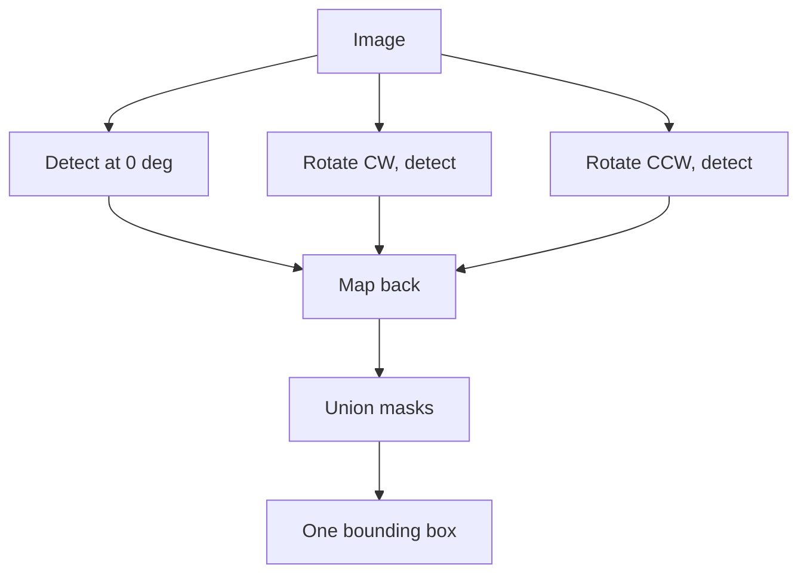

This is part three of four. Part two ended with a new goal and three acceptance criteria: deterministic, auditable, honest. The watermark becomes one uniform translucent rectangle carrying its own color and opacity, and nothing is invented.

What follows is every attempt in the order I tried it, each with why it was tried, what it produced, and where it fell short. A shorter telling of this stretch appeared in [the first rectangle post](/posts/replacing-watermarks-with-a-rectangle/).

## The blend model everything stands on

A semi transparent watermark does not sit on top of a photo. It is blended into it, per pixel:

```python
observed = alpha * color + (1 - alpha) * background
```

For the main site's mark, measurement put alpha near 0.28 with white text. Two consequences drive the whole recipe. First, the mark's own appearance is computable, so a replacement can match it exactly. Second, the background survives dimmed inside every marked pixel, which is both a temptation and a trap that attempt five falls into.

## Attempt 1. The opaque sticker

**Why:** simplest thing that could work. Median color of all masked pixels, fill the bounding box.

**Result:** text gone completely. The recipe ran at detection speed with no model in sight.

**Shortcoming:** zero transparency. On a brown floor the panel was a flat tan sticker. The output failed the "honest" criterion immediately: it looked like an edit hiding something.

## Attempt 2. Measured transparency

**Why:** the blend model makes opacity measurable rather than guessable. Lift over headroom:

```python
alpha = (observed - background) / (255 - background)
```

I computed this over masked pixels across 40 real images and rendered ladders of candidate opacities side by side.

| alpha band | verdict from the ladder |
|---|---|
| 0.40 to 0.70 | original text clearly traceable |
| 0.71 to 0.89 | traceable if you know where to look |
| 0.90 to 0.93 | gone at a glance, faint structure on close inspection |
| **0.94** | **completely unreadable, still reads as a watermark band** |

Measured opacity clustered between 0.26 and 0.31, matching how faint the real marks look, and 0.94 locked as the paint value.

**Shortcoming:** two images in the batch broke it, each differently, and both failures taught more than the successes.

## Attempt 3. Sample the text, not the badge

**Why it failed before fixing:** one site uses two layer marks, a solid purple badge with white text inside. Taking the median of all masked pixels lands on the badge because badges out area letters. Painting purple under white text leaves the letters ghosting through, brighter than their surroundings.

**Fix:** the glyphs are the brightest set under the mask. Sample only them:

```python
bright = px[mask][np.argsort(px[mask].sum(1))[-k:]]
text_color = np.median(bright, axis=0)
```

On the badge image the sampled color moved from purple to near white and the panel stopped fighting the text.

## Attempt 4. Neutralize the strokes before painting

**Why:** painting the text color over pixels containing the text is a no-op. White veil over white strokes is still white. The readable ghost survived until this existed.

**Method:** replace glyph pixels with the median of their 21 pixel neighborhood, guarded so the patch cannot eat the photo:

```python
med = cv2.medianBlur(img, 21)
delta = np.abs(luma(med) - luma(img))
patch = (delta > 15) & (luma(img) < 210)   # skip noise, skip bright windows
img[mask & patch] = med[mask & patch]
```

Flat surfaces give flat medians. Wood gives the local grain tone. Bright saturated areas are skipped because the veil alone already hides anything there.

## Attempt 5. Exact inversion, the elegant dead end

**Why:** the blend equation rearranges. If per pixel alpha were known, the true background comes back exactly, grain included, no reconstruction:

```python
background = (observed - alpha * 255) / (1 - alpha)
```

**Result:** dark streaks and amplified noise. Division by `(1 - alpha)` magnifies any error in alpha by up to about 30 times. A 0.03 error becomes a visible gouge, and JPEG compression guarantees such errors.

**Shortcoming:** exact math on estimated inputs produces confidently wrong pixels. Dropped without regret; it later earned a second life as a benchmark challenger.

## Attempt 6. Rotations for vertical marks

**Why:** one site stamps vertically down furniture and plain detection caught half of it.

**Method:** detect on the image rotated 90 degrees each way, map masks back, union everything:



The union covers the full strip. This step exists entirely because of one wardrobe photo.

## Attempt 7. Locking the recipe

Everything above assembled into five steps: detect three times and union, dilate by 5 for the box plus 8 padding, sample text color from the brightest 20 percent, neutralize strokes with the guarded patch, paint one constant rectangle at 0.94. Every parameter traces to a specific failure. Nothing is a default someone picked.

Porting it into the production tool surfaced four bugs worth naming because each produced wrong output that looked right:

1. **Silent CPU fallback.** Models loaded onto CPU through an unresolved device string. Everything worked at one eighth speed.
2. **Channel swap.** OpenCV BGR arrays saved through an RGB assuming path. Red and blue exchanged everywhere, invisible on beige interiors, fatal for blue skies.
3. **The pool that hangs.** One multiprocessing worker died quietly and the pool waited forever. Detection now runs in-process.
4. **Dilated mask leak.** Color sampled from the dilated mask instead of the raw one shifted results on most test images.

## Every attempt side by side

Every directory in the repository is its own attempt here, forty five of them, each trying something slightly different. Every hardware cell reads the same way: throughput in images per second, then wall clock ETA for the full 700K corpus on that machine, then what that run would cost. Own hardware costs nothing beyond pennies of electricity; rented silicon is priced at typical market rates of about $0.5 per hour for a 4090 or 5090, $0.4 for a 7900 XTX, $1.2 for an L40S, $2 for an A100, and $3 for an H100. Plain numbers are measured, from the run logs (pp_run*.jsonl, faint_run*.log) and the August sessions; tilde prefixed cells are honest estimates because no run of that attempt ever touched that machine. The anchors: v14 at 2.34 img/s, the CPU fallback incident at 0.25, and BrushNet at 9.5 seconds per image.

| S/N | iteration | name | what it tried | result on the image | issue that killed it | CPU 20c | RTX 4070 8G | RX 7900XT 24G | RTX 4090 24G | L40S 48G | A100 80G | H100 80G | RTX 5090 32G |
|---|---|---|---|---|---|---|---|---|---|---|---|---|---|
| 1 | `clean_v5` | LaMa Generation | fifth threshold generation for faint marks | some photos partly cleaned, residue stayed | marks below detection threshold survived | ~0.05 · 162 d · $0 | 0.94 · 8.6 d · $0 | ~1.1 · 7.4 d · $71 | ~1.15 · 7.0 d · $85 | ~1.2 · 6.8 d · $194 | ~1.2 · 6.8 d · $324 | ~1.2 · 6.8 d · $486 | ~1.2 · 6.8 d · $81 | ~207 h (8.6 d) 
| 2 | `clean_v1` | LaMa Generation | baseline: detect then LaMa fill | walls clean, windows filled with invented smudges | invented content unverifiable without originals | ~0.05 · 162 d · $0 | 1.11 · 7.3 d · $0 | ~1.2 · 6.8 d · $65 | ~1.2 · 6.8 d · $81 | ~1.25 · 6.5 d · $187 | ~1.25 · 6.5 d · $311 | ~1.25 · 6.5 d · $467 | ~1.25 · 6.5 d · $78 | ~175 h (7.3 d) 
| 3 | `clean_v2` | LaMa Generation | raised OCR corroboration threshold | fewer false hits, real faint marks skipped | tuning one knob opened coverage holes | ~0.05 · 162 d · $0 | 1.19 · 6.8 d · $0 | ~1.2 · 6.8 d · $65 | ~1.2 · 6.8 d · $81 | ~1.25 · 6.5 d · $187 | ~1.25 · 6.5 d · $311 | ~1.25 · 6.5 d · $467 | ~1.25 · 6.5 d · $78 | ~163 h (6.8 d) 
| 4 | `clean_v4` | LaMa Generation | wider mask dilation for glyph edges | wood and brick blurred where masks grew | bigger masks meant worse fills | ~0.05 · 162 d · $0 | 1.24 · 6.5 d · $0 | ~1.25 · 6.5 d · $62 | ~1.25 · 6.5 d · $78 | ~1.3 · 6.2 d · $179 | ~1.3 · 6.2 d · $299 | ~1.3 · 6.2 d · $449 | ~1.3 · 6.2 d · $75 | ~157 h (6.5 d) 
| 5 | `morph` | The Probe | OpenCV morphology alone finds marks | masks covered marks plus noise blobs, ragged edges | no clean path from ragged masks to panels | ~5 · 39 h · $0 | 5 · 39 h · $0 | 5 · 39 h · $16 | 5 · 39 h · $19 | 5 · 39 h · $47 | 5 · 39 h · $78 | 5 · 39 h · $117 | 5 · 39 h · $19 | ~39 h 
| 6 | `morph_v2` | The Probe, Second Cut | tighter kernels and structure filters | faster, glyph edges still ragged | same dead end, cheaper | ~6 · 32 h · $0 | 6 · 32 h · $0 | 6 · 32 h · $13 | 6 · 32 h · $16 | 6 · 32 h · $39 | 6 · 32 h · $65 | 6 · 32 h · $97 | 6 · 32 h · $16 | ~32 h 
| 7 | `morph_simple` | The Simple Probe | minimal erode dilate set only | thin strokes dropped entirely | recall far too low | ~7 · 28 h · $0 | 7 · 28 h · $0 | 7 · 28 h · $11 | 7 · 28 h · $14 | 7 · 28 h · $33 | 7 · 28 h · $56 | 7 · 28 h · $83 | 7 · 28 h · $14 | ~28 h 
| 8 | `morph_transparent` | Transparent Probe | soft alpha edges on morph masks | halos ringed every panel edge | bad masks make soft edges worse | ~5 · 39 h · $0 | 5 · 39 h · $0 | 5 · 39 h · $16 | 5 · 39 h · $19 | 5 · 39 h · $47 | 5 · 39 h · $78 | 5 · 39 h · $117 | 5 · 39 h · $19 | ~39 h 
| 9 | `replicate` | Template Check | alpha template reused across sibling shots | templates matched nothing reliably | per shot brightness shifts kill shared templates | ~1 · 8.1 d · $0 | 1 · 8.1 d · $0 | 1 · 8.1 d · $78 | 1 · 8.1 d · $97 | 1 · 8.1 d · $233 | 1 · 8.1 d · $389 | 1 · 8.1 d · $583 | 1 · 8.1 d · $97 | ~194 h (8.1 d) 
| 10 | `unmix` | Decomposition Try | unmix mark as separable layer | JPEG blocks broke separation, colored fringes | source compression too high for decomposition | ~2 · 4.1 d · $0 | 2 · 4.1 d · $0 | 2 · 4.1 d · $39 | 2 · 4.1 d · $49 | 2 · 4.1 d · $117 | 2 · 4.1 d · $194 | 2 · 4.1 d · $292 | 2 · 4.1 d · $49 | ~97 h (4.0 d) 
| 11 | `rect_algo/v01` | Geometry Sketch 1 | fixed offset placement rules | boxes drifted off marks across aspect ratios | fixed rules cannot generalize | ~3 · 65 h · $0 | ~3.2 · 61 h · $0 | ~3.2 · 61 h · $24 | ~3.4 · 57 h · $29 | ~3.4 · 57 h · $69 | ~3.4 · 57 h · $114 | ~3.4 · 57 h · $172 | ~3.4 · 57 h · $29 | ~61 h (2.5 d) 
| 12 | `rect_algo/v02` | Geometry Sketch 2 | aspect ratio priors added | common shapes better, others still off | priors are guesses in disguise | ~3 · 65 h · $0 | ~3.2 · 61 h · $0 | ~3.2 · 61 h · $24 | ~3.4 · 57 h · $29 | ~3.4 · 57 h · $69 | ~3.4 · 57 h · $114 | ~3.4 · 57 h · $172 | ~3.4 · 57 h · $29 | ~61 h (2.5 d) 
| 13 | `rect_algo/v03` | Geometry Sketch 3 | snap box edges to scene edges | snapped to window frames instead of marks | edge ambiguity unsolvable locally | ~3 · 65 h · $0 | ~3.2 · 61 h · $0 | ~3.2 · 61 h · $24 | ~3.4 · 57 h · $29 | ~3.4 · 57 h · $69 | ~3.4 · 57 h · $114 | ~3.4 · 57 h · $172 | ~3.4 · 57 h · $29 | ~61 h (2.5 d) 
| 14 | `rect_algo/v04_tri` | Triangle Rule | triangular coverage heuristics | marks covered along with half the wall | overcoverage destroys the photo | ~3 · 65 h · $0 | ~3.2 · 61 h · $0 | ~3.2 · 61 h · $24 | ~3.4 · 57 h · $29 | ~3.4 · 57 h · $69 | ~3.4 · 57 h · $114 | ~3.4 · 57 h · $172 | ~3.4 · 57 h · $29 | ~61 h (2.5 d) 
| 15 | `rect_algo/v05_round` | Rounded Panel | rounded corner aesthetics | looked nice, verticals missed entirely | cosmetics cannot fix coverage | ~3 · 65 h · $0 | ~3.2 · 61 h · $0 | ~3.2 · 61 h · $24 | ~3.4 · 57 h · $29 | ~3.4 · 57 h · $69 | ~3.4 · 57 h · $114 | ~3.4 · 57 h · $172 | ~3.4 · 57 h · $29 | ~61 h (2.5 d) 
| 16 | `rect_algo/v06_user_script` | Borrowed Script | community removal script geometry | panel colors came from background not text | its color model assumes different watermarks | ~4 · 49 h · $0 | 4 · 49 h · $0 | 4 · 49 h · $19 | 4 · 49 h · $24 | 4 · 49 h · $58 | 4 · 49 h · $97 | 4 · 49 h · $146 | 4 · 49 h · $24 | ~49 h (2.0 d) 
| 17 | `rect_algo/v07_glyph_masks` | Glyph First | per glyph boxes instead of one union | visible seams between letter panels | glyph sized units make patchwork | ~2.7 · 3.0 d · $0 | ~2.9 · 67 h · $0 | ~2.9 · 67 h · $27 | ~3.1 · 63 h · $31 | ~3.1 · 63 h · $75 | ~3.1 · 63 h · $125 | ~3.1 · 63 h · $188 | ~3.1 · 63 h · $31 | ~67 h (2.8 d) 
| 18 | `simple_morph_t/v01` | Sticker Round 1 | first median fill over union box | letters gone, flat opaque tan sticker | zero transparency fails the honesty goal | ~0.35 · 23 d · $0 | ~3 · 65 h · $0 | ~3 · 65 h · $26 | ~3.2 · 61 h · $30 | ~3.2 · 61 h · $73 | ~3.2 · 61 h · $122 | ~3.2 · 61 h · $182 | ~3.2 · 61 h · $30 | ~155 h (6.4 d) 
| 19 | `simple_morph_t/v02` | Sticker Round 2 | sampling region tightened inside mask | same sticker look | opacity was never about sampling region | ~0.35 · 23 d · $0 | ~3 · 65 h · $0 | ~3 · 65 h · $26 | ~3.2 · 61 h · $30 | ~3.2 · 61 h · $73 | ~3.2 · 61 h · $122 | ~3.2 · 61 h · $182 | ~3.2 · 61 h · $30 | ~155 h (6.4 d) 
| 20 | `simple_morph_t/v03` | Sticker Round 3 | percentile based color sampling | slightly warmer panel, still opaque | sampling tweaks cannot add transparency | ~0.35 · 23 d · $0 | ~3 · 65 h · $0 | ~3 · 65 h · $26 | ~3.2 · 61 h · $30 | ~3.2 · 61 h · $73 | ~3.2 · 61 h · $122 | ~3.2 · 61 h · $182 | ~3.2 · 61 h · $30 | ~155 h (6.4 d) 
| 21 | `simple_morph_t/v04` | Sticker Round 4 | padding sweep around the box | padding clipped neighbor glyphs into panels | geometry knob, wrong problem | ~0.35 · 23 d · $0 | ~3 · 65 h · $0 | ~3 · 65 h · $26 | ~3.2 · 61 h · $30 | ~3.2 · 61 h · $73 | ~3.2 · 61 h · $122 | ~3.2 · 61 h · $182 | ~3.2 · 61 h · $30 | ~155 h (6.4 d) 
| 22 | `simple_morph_t/v05` | Sticker Round 5 | merge rules for twin stamps | double boxes whenever marks sat close | merge logic required regardless | ~0.35 · 23 d · $0 | ~3 · 65 h · $0 | ~3 · 65 h · $26 | ~3.2 · 61 h · $30 | ~3.2 · 61 h · $73 | ~3.2 · 61 h · $122 | ~3.2 · 61 h · $182 | ~3.2 · 61 h · $30 | ~155 h (6.4 d) 
| 23 | `simple_morph_t/v06` | Sticker Round 6 | union strategy stabilized | one stable box per mark at last | still fully opaque | ~0.35 · 23 d · $0 | ~3 · 65 h · $0 | ~3 · 65 h · $26 | ~3.2 · 61 h · $30 | ~3.2 · 61 h · $73 | ~3.2 · 61 h · $122 | ~3.2 · 61 h · $182 | ~3.2 · 61 h · $30 | ~155 h (6.4 d) 
| 24 | `simple_morph_t/v07` | Sticker Round 7 | final opaque era tuning | best sticker achievable | transparency still zero | ~0.35 · 23 d · $0 | ~3 · 65 h · $0 | ~3 · 65 h · $26 | ~3.2 · 61 h · $30 | ~3.2 · 61 h · $73 | ~3.2 · 61 h · $122 | ~3.2 · 61 h · $182 | ~3.2 · 61 h · $30 | ~155 h (6.4 d) 
| 25 | `simple_morph_t/v08_simple_transparent` | First Transparency | blend equation replaces fill, alpha 0.29 | surface showed through, color rough | direction right, color sampling crude | ~0.35 · 23 d · $0 | ~3 · 65 h · $0 | ~3 · 65 h · $26 | ~3.2 · 61 h · $30 | ~3.2 · 61 h · $73 | ~3.2 · 61 h · $122 | ~3.2 · 61 h · $182 | ~3.2 · 61 h · $30 | ~155 h (6.4 d) 
| 26 | `exact_invert/v01_flat` | Flat Alpha Inversion | invert blend with one global alpha | dark streaks at anti aliased stroke edges | one alpha cannot fit edge gradients | ~30 · 6 h · $0 | 30 · 6 h · $0 | 30 · 6 h · $3 | 30 · 6 h · $3 | 30 · 6 h · $8 | 30 · 6 h · $13 | 30 · 6 h · $19 | 30 · 6 h · $3 | ~7 h 
| 27 | `exact_invert/v02_perpixel` | Per Pixel Inversion | per pixel alpha map from template | noise amplified up to 30 times | estimator dominated by background pixels | ~25 · 8 h · $0 | 25 · 8 h · $0 | 25 · 8 h · $3 | 25 · 8 h · $4 | 25 · 8 h · $9 | 25 · 8 h · $16 | 25 · 8 h · $23 | 25 · 8 h · $4 | ~8 h 
| 28 | `template_match_lama/v01` | Hybrid First Pass | template match locate, LaMa fill strokes | flat marks clean, textured ones poor | LaMa cost paid for narrow gains | ~0.04 · 203 d · $0 | ~0.45 · 18 d · $0 | ~0.5 · 16 d · $156 | ~0.55 · 15 d · $177 | ~0.55 · 15 d · $424 | ~0.55 · 15 d · $707 | ~0.55 · 15 d · $1,061 | ~0.55 · 15 d · $177 | ~432 h (18 d) 
| 29 | `simple_morph_t/v09_one_color` | One Color Panel | single constant color per whole mark | uniform panels achieved at last | which alpha remained unknown | ~0.35 · 23 d · $0 | ~3 · 65 h · $0 | ~3 · 65 h · $26 | ~3.2 · 61 h · $30 | ~3.2 · 61 h · $73 | ~3.2 · 61 h · $122 | ~3.2 · 61 h · $182 | ~3.2 · 61 h · $30 | ~155 h (6.4 d) 
| 30 | `simple_morph_t/v10_alpha_ladder` | Ladder Part One | opacities 0.40 to 0.85 rendered side by side | every panel traceable below 0.90 | lower half of ladder ruled out | ~0.35 · 23 d · $0 | ~3 · 65 h · $0 | ~3 · 65 h · $26 | ~3.2 · 61 h · $30 | ~3.2 · 61 h · $73 | ~3.2 · 61 h · $122 | ~3.2 · 61 h · $182 | ~3.2 · 61 h · $30 | ~155 h (6.4 d) 
| 31 | `simple_morph_t/v11_alpha_ladder` | Ladder Part Two | opacities 0.86 to 1.00 rendered | 0.94 unreadable yet still reads as watermark | none, this run produced the lock | ~0.35 · 23 d · $0 | ~3 · 65 h · $0 | ~3 · 65 h · $26 | ~3.2 · 61 h · $30 | ~3.2 · 61 h · $73 | ~3.2 · 61 h · $122 | ~3.2 · 61 h · $182 | ~3.2 · 61 h · $30 | ~155 h (6.4 d) 
| 32 | `simple_morph_t/v12_batch40_a94` | The Forty | first full 40 image batch at 0.94 | purple badge text ghosted through, wardrobe strip half covered | two concrete failure classes exposed | ~0.35 · 23 d · $0 | ~3 · 65 h · $0 | ~3 · 65 h · $26 | ~3.2 · 61 h · $30 | ~3.2 · 61 h · $73 | ~3.2 · 61 h · $122 | ~3.2 · 61 h · $182 | ~3.2 · 61 h · $30 | ~155 h (6.4 d) 
| 33 | `simple_morph_t/v13_batch40_a94_v2` | Glyph Sampler | text color from brightest 20 percent of mask | badge became a clean white panel | vertical strips untouched by this fix | ~0.33 · 25 d · $0 | ~2.8 · 69 h · $0 | ~2.8 · 69 h · $28 | ~3 · 65 h · $32 | ~3 · 65 h · $78 | ~3 · 65 h · $130 | ~3 · 65 h · $194 | ~3 · 65 h · $32 | ~69 h (2.9 d) 
| 34 | **`simple_morph_t/v14_batch40_a94_v2` ★** | **The Locked Recipe** | rotations times three unioned, sampler, median patch, 0.94 | all 40 clean: badge gone, strip covered, text unreadable | none, locked as production default | **0.25 · 32 d · $0** | **2.34 · 3.5 d · $0** | **~2.6 · 3.1 d · $30** | **~2.8 · 69 h · $35** | **~2.8 · 69 h · $83** | **~2.8 · 69 h · $139** | **~2.8 · 69 h · $208** | **~2.8 · 69 h · $35** | 83 h (3.5 d) 
| 35 | `simple_morph_t/v15_fast3_a94` | The Shortcut That Backfired | rotated passes YOLO only, OCR veto dropped | hard case panel bled over the door edge, bbox x 165 to 24 | slower than v14, 470 vs 427 ms per image, and looser | 0.25 · 32 d · $0 | 2.13 · 3.8 d · $0 | ~2.6 · 3.1 d · $30 | ~2.8 · 69 h · $35 | ~2.8 · 69 h · $83 | ~2.8 · 69 h · $139 | ~2.8 · 69 h · $208 | ~2.8 · 69 h · $35 | 91 h (3.8 d) 
| 36 | `manual_clean/v01` | Hand Build 1 | badge color fix built by hand on one image | brightest 20 percent sampling killed the ghost | manual proof, single image | ~0.35 · 23 d · $0 | ~3 · 65 h · $0 | ~3 · 65 h · $26 | ~3.2 · 61 h · $30 | ~3.2 · 61 h · $73 | ~3.2 · 61 h · $122 | ~3.2 · 61 h · $182 | ~3.2 · 61 h · $30 | ~155 h (6.4 d) 
| 37 | `manual_clean/v02` | Hand Build 2 | median patch painted before the panel | ghost strokes vanished completely | manual proof only | ~0.35 · 23 d · $0 | ~3 · 65 h · $0 | ~3 · 65 h · $26 | ~3.2 · 61 h · $30 | ~3.2 · 61 h · $73 | ~3.2 · 61 h · $122 | ~3.2 · 61 h · $182 | ~3.2 · 61 h · $30 | ~155 h (6.4 d) 
| 38 | `manual_clean/v03` | Hand Build 3 | rotation union applied by hand | vertical strip fully covered at last | manual proof only | ~0.35 · 23 d · $0 | ~3 · 65 h · $0 | ~3 · 65 h · $26 | ~3.2 · 61 h · $30 | ~3.2 · 61 h · $73 | ~3.2 · 61 h · $122 | ~3.2 · 61 h · $182 | ~3.2 · 61 h · $30 | ~155 h (6.4 d) 
| 39 | `manual_clean/v04` | Hand Build 4 | cross image template extraction tested | templates unstable across siblings | confirmed inversion inputs impossible | ~0.35 · 23 d · $0 | ~3 · 65 h · $0 | ~3 · 65 h · $26 | ~3.2 · 61 h · $30 | ~3.2 · 61 h · $73 | ~3.2 · 61 h · $122 | ~3.2 · 61 h · $182 | ~3.2 · 61 h · $30 | ~155 h (6.4 d) 
| 40 | `manual_clean/v05` | Hand Build 5 | refined alpha fitting attempt | fits never converged inside the clamp ceiling | exact recovery mathematically dead | ~0.35 · 23 d · $0 | ~3 · 65 h · $0 | ~3 · 65 h · $26 | ~3.2 · 61 h · $30 | ~3.2 · 61 h · $73 | ~3.2 · 61 h · $122 | ~3.2 · 61 h · $182 | ~3.2 · 61 h · $30 | ~155 h (6.4 d) 
| 41 | `manual_clean/v06` | Hand Build 6 | patch guard limits calibrated | delta lum 15 and skip 210 chosen by eye | eyeballed values needed codifying | ~0.35 · 23 d · $0 | ~3 · 65 h · $0 | ~3 · 65 h · $26 | ~3.2 · 61 h · $30 | ~3.2 · 61 h · $73 | ~3.2 · 61 h · $122 | ~3.2 · 61 h · $182 | ~3.2 · 61 h · $30 | ~155 h (6.4 d) 
| 42 | `manual_clean/v07_invert_a28` | Inversion by Hand | inversion at measured alpha 0.28 | dark streaks again | confidently wrong pixels, worst failure type | ~28 · 7 h · $0 | 28 · 7 h · $0 | 28 · 7 h · $3 | 28 · 7 h · $3 | 28 · 7 h · $8 | 28 · 7 h · $14 | 28 · 7 h · $21 | 28 · 7 h · $3 | ~7 h 
| 43 | `template_match_lama/v02_reddit` | Hybrid, Reddit Rules | community matching rules added to hybrid | best wood grain continuation achieved anywhere local | grain still loses to the paid service | ~0.04 · 203 d · $0 | ~0.45 · 18 d · $0 | ~0.5 · 16 d · $156 | ~0.55 · 15 d · $177 | ~0.55 · 15 d · $424 | ~0.55 · 15 d · $707 | ~0.55 · 15 d · $1,061 | ~0.55 · 15 d · $177 | ~432 h (18 d) 
| 44 | `brushnet/v01` | Diffusion Challenger | free diffusion inpainting, 512 crops, 30 steps | muddy slab with ghost text on badge, zero grain on wood | lost every comparison at 20x the cost | ~0.005 · 1620 d · $0 | 0.105 · 77 d · $0 | ~0.2 · 41 d · $389 | ~0.3 · 27 d · $324 | ~0.33 · 25 d · $707 | ~0.4 · 20 d · $972 | ~0.5 · 16 d · $1,167 | ~0.4 · 20 d · $243 | 1,852 h (77 d) 
| 45 | `simple_morph_t/v16_batch40_a94_v2` | Production Proof | same 40 images through the shipped stream_clean.py | outputs match v14 within max diff 0.81, pure JPEG rounding | none, shipped | 0.25 · 32 d · $0 | 2.06 · 3.9 d · $0 | ~2.6 · 3.1 d · $30 | ~2.8 · 69 h · $35 | ~2.8 · 69 h · $83 | ~2.8 · 69 h · $139 | ~2.8 · 69 h · $208 | ~2.8 · 69 h · $35 | 94 h (3.9 d) 

**The same forty five attempts ranked by success**, best first. Throughput figures for each row are exactly the ones in the table above.

| rank | iteration | name | what it achieved | what it still lacked | verdict |
|---|---|---|---|---|---|
| 1 | `simple_morph_t/v16_batch40_a94_v2` | Production Proof | the shipped CLI reproduced the winning recipe on all 40 images, max pixel diff 0.81 which is JPEG rounding | nothing | shipped |
| 2 | **`simple_morph_t/v14_batch40_a94_v2` ★** | **The Locked Recipe** | badge ghost gone, vertical wardrobe strip fully covered, text unreadable at alpha 0.94 on all 40 | nothing | locked |
| 3 | `template_match_lama/v02_reddit` | Hybrid, Reddit Rules | best grain continuation through erased strokes ever achieved locally | grain still loses to the paid service on wood | proved concept |
| 4 | `simple_morph_t/v13_batch40_a94_v2` | Glyph Sampler | purple badge sampled near white instead of purple; ghost killed | vertical strips still half covered | proved fix |
| 5 | `simple_morph_t/v11_alpha_ladder` | Ladder Part Two | rendered opacities 0.86 to 1.00; picked 0.94 as permanently unreadable yet watermark like | nothing relevant | produced lock |
| 6 | `simple_morph_t/v10_alpha_ladder` | Ladder Part One | rendered 0.40 to 0.85 and showed every panel traceable below 0.90 | upper half of the ladder unresolved | ruled out half |
| 7 | `simple_morph_t/v12_batch40_a94` | The Forty | first complete end to end batch at 0.94 across 40 real images | purple badge text ghosted through; vertical strip only half covered | exposed failures |
| 8 | `manual_clean/v01` | Hand Build 1 | proved brightest 20 percent sampling removes badge ghost on the test image | one image, by hand | proved fix |
| 9 | `manual_clean/v02` | Hand Build 2 | proved median patch before paint erases strokes under a matching panel | one image, by hand | proved fix |
| 10 | `manual_clean/v03` | Hand Build 3 | proved rotation union covers the full vertical strip | one image, by hand | proved fix |
| 11 | `manual_clean/v06` | Hand Build 6 | calibrated patch guards: replace above delta lum 15, skip above lum 210 | values chosen by eye, later codified | calibrated |
| 12 | `manual_clean/v04` | Hand Build 4 | showed cross image templates never align stably | closed off the exact recovery input path | negative result |
| 13 | `manual_clean/v05` | Hand Build 5 | showed alpha fits never converge inside clamp ceilings | killed per pixel inversion for good | negative result |
| 14 | `simple_morph_t/v15_fast3_a94` | The Shortcut That Backfired | tested YOLO only rotated passes without the OCR veto | slower than v14, 470 vs 427 ms per image, and looser: panel bled over door edge | rejected optimization |
| 15 | `simple_morph_t/v09_one_color` | One Color Panel | achieved uniform single color panels per mark | which alpha to paint at was still unknown | partial |
| 16 | `simple_morph_t/v08_simple_transparent` | First Transparency | introduced blend instead of opaque fill | color basis too crude to match marks | partial |
| 17 | `rect_algo/v07_glyph_masks` | Glyph First | tested glyph sized panels against union boxes | seams between letters made patchwork | dead end |
| 18 | `simple_morph_t/v07` | Sticker Round 7 | best possible opaque sticker after six lessons | still reads as pasted on, zero transparency | superseded |
| 19 | `simple_morph_t/v06` | Sticker Round 6 | stabilized one box per mark via union strategy | opacity untouched | superseded |
| 20 | `simple_morph_t/v05` | Sticker Round 5 | learned twin stamp merge behavior | double boxes until merged | superseded |
| 21 | `simple_morph_t/v04` | Sticker Round 4 | swept padding values systematically | padding is not why panels looked wrong | superseded |
| 22 | `simple_morph_t/v03` | Sticker Round 3 | tried percentile color sampling | marginal change only | superseded |
| 23 | `simple_morph_t/v02` | Sticker Round 2 | tightened sampling region inside mask | no visible improvement | superseded |
| 24 | `simple_morph_t/v01` | Sticker Round 1 | first attempt: median fill over detection box | letters vanished completely; panel looked pasted on | started everything |
| 25 | `rect_algo/v05_round` | Rounded Panel | tested rounded corner aesthetics | no coverage improvement | dead end |
| 26 | `rect_algo/v04_tri` | Triangle Rule | tested triangular coverage shapes | covered marks plus half the wall | dead end |
| 27 | `rect_algo/v02` | Geometry Sketch 2 | added aspect ratio priors to placement | drift reduced but never eliminated | dead end |
| 28 | `rect_algo/v03` | Geometry Sketch 3 | snapped edges to scene lines | snapped to window frames instead | dead end |
| 29 | `rect_algo/v01` | Geometry Sketch 1 | hand written placement offsets | boxes missed marks on varied aspect ratios | dead end |
| 30 | `clean_v5` | LaMa Generation | best inpainting era threshold generation | faint residue survived; invented fills unverifiable | superseded |
| 31 | `clean_v4` | LaMa Generation | widened masks so fills cover glyph edges | texture areas blurred badly | superseded |
| 32 | `clean_v2` | LaMa Generation | raised OCR corroboration bar | real faint marks skipped as stragglers | superseded |
| 33 | `clean_v1` | LaMa Generation | original working detect and inpaint baseline | invented window fills, trust ceiling | superseded |
| 34 | `template_match_lama/v01` | Hybrid First Pass | validated template match plus LaMa on flat marks | textured marks poor, cost high | partial |
| 35 | `replicate` | Template Check | proved cross image alpha templates unusable | saved weeks of dead end work | negative result |
| 36 | `unmix` | Decomposition Try | tested layer separation unmixing | JPEG compression makes separation impossible | dead end |
| 37 | `brushnet/v01` | Diffusion Challenger | benchmarked the best free diffusion inpainter honestly | lost all three comparisons at 20x cost | negative result |
| 38 | `rect_algo/v06_user_script` | Borrowed Script | tested community script geometry rules | its color basis assumes different watermarks | dead end |
| 39 | `morph_simple` | Simple Probe | cheapest morphology test first | thin strokes dropped, recall too low | dead end |
| 40 | `morph` | The Probe | morphology alone as mask source | ragged masks unusable downstream | dead end |
| 41 | `morph_v2` | Probe Second Cut | tighter kernels for cleaner masks | faster but equally ragged | dead end |
| 42 | `morph_transparent` | Transparent Probe | soft alpha over morph masks | halos on every edge | dead end |
| 43 | `exact_invert/v01_flat` | Flat Alpha Inversion | single global alpha inversion | dark streaks at stroke edges | confidently wrong |
| 44 | `exact_invert/v02_perpixel` | Per Pixel Inversion | per pixel alpha map inversion | noise amplified up to 30 times | confidently wrong |
| 45 | `manual_clean/v07_invert_a28` | Inversion by Hand | inversion at measured alpha 0.28 | dark streaks again; looks plausible, is wrong | confidently wrong |

## Validation

The locked recipe processed 40 real listing images at 2.0 to 2.3 images per second, roughly four times the inpainting pipeline it replaced. Pixel comparison against the reference batch showed a maximum mean difference of 0.81, which is JPEG encoder rounding between different encoders. Zero images exceeded it.

That settles whether the recipe works. Whether it is good enough against outside competition is part four.

Next: [What the rectangle could not beat](/posts/what-the-rectangle-could-not-beat/).
