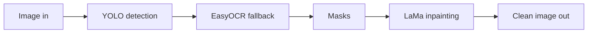

My scraper pulls real estate listing images into MinIO. Every single one carries the host site's watermark. The count was 113,998 when I first attacked this problem, and it has since grown to roughly 489,000, with 700,000 as the planning number. The question that started everything was the obvious one. How do we remove watermarks from all of them?

This post is part one of a four part series about where that question led. Part one is the first answer and why it was not good enough. A shorter version of this stretch appeared earlier in [the pipeline speed post](/posts/taking-a-12-day-image-pipeline-down-to-two-days/); here I go slower.

## What a watermark on these images actually is

Two sites matter. One stamps a horizontal band of semi transparent white text across the middle of the photo. The other uses solid badges with text inside them, sometimes rotated vertical along furniture. Both are baked into the pixels at export time. There is no metadata to undo, no clean original to fetch.

The hardware is a laptop: RTX 4070 with 8 GB of VRAM, 46 GB of RAM, 20 cores. Every number in this series comes from it.

## The first answer: detect, mask, inpaint

The classic pipeline has three stages. A detector finds the watermark region. The region becomes a mask. An inpainting model fills the masked area with plausible content, reconstructing what the watermark hides.

Detection runs twice on purpose. YOLO with DeMark weights catches the stamp shapes it was trained on. EasyOCR catches text marks the YOLO model never saw, because OCR finds text regardless of how it is styled. Their boxes merge into one mask.

LaMa then rebuilds the background under the mask. It is good at exactly the surfaces these photos are full of: walls, floors, sky, brick.

## Making it fast enough to matter

Before judging quality I made speed a solved problem, because an unusable pipeline answers nothing. That work filled [the previous post](/posts/taking-a-12-day-image-pipeline-down-to-two-days/): six parallelization strategies benchmarked, a pixel diff gate proving every optimization changed nothing visually, and a result of two days instead of twelve for a 180K corpus. The design rule that mattered: cleaning always runs on full resolution images, so quality never moves no matter what trick goes upstream.

With speed settled, the real question surfaced. Is the output actually clean?

## The bake-off: six reconstruction models

If LaMa fills masks, maybe another model fills them better. I wired six candidates behind one flag and ran them on the same watermarked images:

| model | verdict | shortcoming |
|---|---|---|
| LaMa | best texture continuation on flat surfaces, fast, stable | invents nothing wild but also repairs nothing hard |
| MAT | strong on very large masks | slower, occasional tone drift against surrounding walls |
| FCF | decent general fills | weaker on repetitive texture like brick |
| MiGAN | fastest of all | visibly blurrier fills |
| ZITS | best structural reasoning over big holes | heavy dependency chain, slowest by far |
| SD inpainting | most inventive reconstructions | least trustworthy, invented objects behind marks |

LaMa won on the combination that matters for a batch job: quality per second and boring reliability. ZITS was interesting and unusable. Stable Diffusion was fascinating and dangerous, which foreshadows everything that follows.

## Where the whole approach cracked

The pipeline ran end to end at around half an image per second once the quality gate rechecked every output. Then I actually looked at the cleaned photos.

Three failure patterns showed up again and again:

1. **Invented content.** Behind a watermark crossing a bright window, LaMa produced a smudge. Sometimes worse than a smudge: textures that continue plausibly and then resolve into something impossible.
2. **Nondeterminism.** The same input could produce slightly different fills across runs and seeds. For a corpus you audit in samples, that is poison.
3. **A gate that cannot scale.** Every output needs human eyes or a second model to catch invention. At 489K images there is no budget for either at any meaningful review rate.

Erasure had a ceiling, and the ceiling was trust. The next post is about the reviews that proved it and the decision that came out of them.

Next: [Why I stopped erasing watermarks](/posts/why-i-stopped-erasing-watermarks/).
