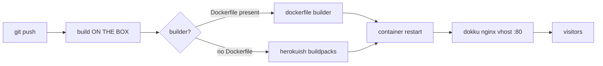
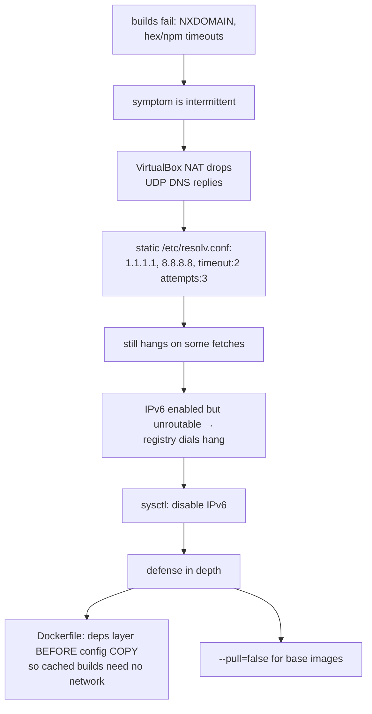

This is part two of four in the deployment tools series ([part one: OpenShip](/posts/testing-openship-locally/)). Where OpenShip wraps your box in a dashboard, a service catalog and a guided mail wizard, **Dokku is the opposite bet**: everything happens through plain git pushes and a terminal. `git push` lands on the server, the server builds, the server routes. It has been the minimal-heroku answer for a decade, and it is still the first tool people reach for when they want PaaS behavior without PaaS weight.

I spent a week with it on the same lab hardware as part one:

| Spec | Value |
|---|---|
| Hypervisor | VirtualBox (via Vagrant) |
| Guest OS | Ubuntu 22.04 (`ubuntu/jammy64` box) |
| vCPU | 2 |
| RAM | 8 GB |
| Disk | ~39 GB guest disk (9.3 GB used after the baseline apps) |
| Network | host-only, `192.168.56.10`, hostname `dokku.local` |

And I did not stop at hello-world. The week included a real Phoenix/LiveView application, dynamic OG image generation, eight benchmark apps sharing one Postgres, and a DNS mystery that ate an afternoon.

## The shape of the thing

Dokku's control plane is almost free:

| Measurement | Value |
|---|---|
| Control-plane RAM overhead | ~0 (nginx + CLI, host-native; no dashboard containers) |
| Cold `git push` → HTTP 200 (hello world) | 62 s |
| postgres:create + link + redis:create + link | ~2 min, app redeploys itself per link |
| Whole VM idle | 745 MB used |

That last plugin row deserves emphasis because it is Dokku at its best:

```bash
dokku postgres:create shopdb
dokku postgres:link shopdb shop
```

The link injects `DATABASE_URL` into the app *and redeploys it*. My `/health` endpoint reported `reachable: true` on the next boot without me touching a config file. Cross-service wiring inside one app "just works".

## Deploy model: build where you serve



Two lessons from that diagram, both learned the hard way:

**The builder picks silently.** A mix.exs app pushed alongside a leftover Dockerfile built with the dockerfile builder, not the Elixir buildpack. No warning — Dockerfile presence just wins detection. If you want buildpacks, delete the Dockerfile or set `dokku builder:set` explicitly.

**Always pin ports immediately after first deploy.** With no explicit mapping, dokku's generated vhost listens on whatever port the image `EXPOSE`s. My first Go app answered only on `:4000` while `:80` served the default nginx welcome page. The rule:

```bash
dokku ports:set <app> http:80:<exposed-port>
```

## The NAT DNS saga

Halfway through the week, pushes started failing with NXDOMAIN and hex fetch timeouts. The pattern was intermittent, which made it worse. The full diagnosis chain:



The meta-lesson: on a desktop-virtualization stack, network flakiness is rarely the guest's fault, but the fix still has to live in the guest.

## A real app: LiveView + dynamic OG images

The main tenant was `shop`, a Phoenix 1.7 app with LiveView 1.2 — counter and ticker pages backed by PubSub, DB-synced every few seconds. Two stories from it are worth telling.

**The UI that was frozen while every probe passed.** Wire-level tests (k6 speaking the LiveView protocol) showed joins, events, diffs — everything green. In a real browser the page loaded and then did nothing. Root cause: vendored client JS `phoenix_live_view@1.0.17` against server `1.2.10`. The client logged an asset version mismatch, threw during view binding, and died silently. Socket fine, events fine, UI dead.

The durable lesson: **only a real browser DOM assertion counts** for interactive apps. Headless Chromium clicking the button and checking the `<h1>` changed is now part of my deploy verification, not optional.

**Dynamic OG cards via og_ex.** The `/store` route renders HEEx + CSS through og_ex into a 1200×630 PNG (~46 KB): cache hits at ~286 rps (≈3.5 ms), misses render in 20–45 ms. Integration found a genuine upstream bug — pages mounted at exactly `/` produce `/opengraph-image/<token>` URLs that the dispatcher regex cannot parse (it requires a page-path prefix), so the card 404s. Drafted the issue upstream with repro and cause. That is the other dividend of platform testing: you end up contributing fixes back.

## Eight apps, one Postgres

The benchmarks (part of a [separate post](/posts/benchmarking-nine-web-stacks-on-one-box/)) put eight apps against a single linked Postgres. Each app ran a pool of 50 connections. Mid-bench, writes started failing: **eight pools × 50 = 400 potential connections against a default `max_connections=100`**. Idle pools hold their sockets; sizing must count every linked app, not just the busy one.

```bash
# inside the postgres container
ALTER SYSTEM SET max_connections = 500;
# then restart the service container
```

## What the proxy costs

Every dokku app sits behind its nginx vhost, which is convenient and not free. Measured on identical runs:

| Path | Direct to container | Via dokku nginx | Tax |
|---|---|---|---|
| LiveView WS event→DB | 1201/s · 25 ms med | 659/s · 75 ms med | **~1.8× slower, +50 ms RTT** |
| Raw Cowboy WS event→DB | 1398/s · 18 ms med | 670/s · 77 ms med | ~2.1× |
| WS connection ceiling | container ulimit-bound (raised to 262k) | `worker_connections 768 × 2 workers` ≈ **~1.5k conns** | proxy caps first |

For WS-heavy apps, tuning nginx (or bypassing it) is not optional polish; it is the difference between two configurations of the same app.

## Ops reality

The cheat-sheet that accumulated over the week:

| Task | Command |
|---|---|
| Tail logs | `dokku logs <app> -t` |
| Restart after config change | `dokku ps:restart <app>` |
| Clean orphan containers after failed push | `dokku cleanup` |
| Run migrations | `dokku run <app> /opt/app/bin/app eval 'App.Release.migrate'` |
| Raise file limits for WS apps | `dokku docker-options:add <app> deploy '--ulimit nofile=262144:262144'` |
| Skip registry checks on flaky network | `dokku docker-options:add <app> build '--pull=false'` |

Note what is absent: a dashboard. Everything above is CLI. For some people that is Dokku's whole appeal; for everyone else it is the reason the next two candidates exist.

## OpenShip vs Dokku, head to head

Same checklist as part one, same lab rules:

| Axis | OpenShip | Dokku |
|---|---|---|
| Deploy trigger | dashboard project wizard (CLI/desktop/MCP exist too) | git push remote |
| Build location | on the box (self-hosted targets) | on the box |
| Server-side footprint | compose control stack ≈ 2 GB + build load | thin: nginx + CLI, ≈ 0 RAM |
| Rollback / redeploys | dashboard Redeploy button | rebuild via push (old image if retained) |
| Dashboard | yes, plus CLI parity | none (CLI only) |
| Services | catalog + env injection; cross-project sharing via host ports (#266) | plugins: PG/Redis solid, mail = DIY |
| Mail | guided host-installed engine (iRedMail) | DIY (docker-mailserver works, with fights) |
| Proxy | OpenResty edge, auto SSL | per-app nginx vhosts, LE via plugin |
| Multi-app on small box | builds compete with serving | builds compete with serving (62 s cold, minutes warm) |
| Mental model | product — the dashboard is the product | script collection, in the affectionate sense |

Both platforms build on the box in this comparison, so the real fork is interface philosophy: a control panel that manages services for you, versus a terminal where every layer is readable and repairable. Where Dokku genuinely won this week: transparency. When something broke I could read the exact generated nginx config, exec into any container, and fix forward with standard Linux tools. There is no layer between me and the machine. When OpenShip broke (the compose project rename), the abstraction boundary was precisely where debugging got hard.

*Next up in this series: Dokploy — the Docker-compose-native middle ground. Then Coolify. Both get the same gauntlet.*

*Meanwhile, the benchmark half of this week — nine web stacks measured on these same VMs — is its own post: [Benchmarking nine web stacks on one box](/posts/benchmarking-nine-web-stacks-on-one-box/).*
