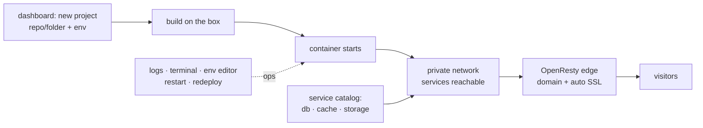

This is part one of a four part series on deployment management tools. I am putting four platforms through the same gauntlet on identical VirtualBox VMs Ubuntu Jammy, 2 vCPU, host-only networking, enough RAM for each platform to show its true appetite. The candidates: **OpenShip**, **Dokku**, **Dokploy**, and **Coolify**. Parts three and four come later; this post covers the newest challenger.

The question behind the series is simple: when I rebuild my own stack, what do I want between "my code is done" and "it is running, routed, backed up"?

## What OpenShip is

[OpenShip](https://openship.io) is an open source (Apache-2.0) deployment platform, and the first thing to understand about it is that it is **dashboard-first**. You do not wire a git remote and push. You open the web dashboard, create a project, point it at a repository or folder, set environment variables in a form, and hit deploy. Day-two operations streamed logs, a shell terminal, an env editor, start/stop/restart/redeploy are buttons on the same page. There is a CLI with feature parity, a desktop app, and an MCP server for driving deploys from AI agents, but the mental model is a control panel, not a push protocol.

Under the hood it is honest Docker: `openship up` provisions a compose stack (its own Postgres, Redis, the API on `:4000`, the dashboard on `:3001`, and an OpenResty edge on `:80/:443`), and every deployed app lands as a plain container on the same box. Builds for self-hosted targets run on the box itself which matters for the resource math later.

## The lab

One VM on VirtualBox, driven by a short Vagrantfile:

| Spec | Value |
|---|---|
| Hypervisor | VirtualBox (via Vagrant) |
| Guest OS | Ubuntu 22.04 (`ubuntu/jammy64` box) |
| vCPU | 2 (host execution capped ~50% for long-running sessions) |
| RAM | 6 GB in the final layout, plus a 2 GB swapfile added when the mail stack arrived |
| Network | host-only, `192.168.56.20`, hostname `openship.local` |

The RAM number has a story: the VM was resized more than once as Postiz + Elasticsearch + mail all moved in that trajectory is itself a review of OpenShip's appetite, and it reappears in the resource section below.

Docker gets installed by the provisioner if missing, then:

```bash
curl -fsSL https://get.openship.io | sh
openship up --non-interactive \
 --admin-email admin@openship.local --domain-kind none
```

The `--domain-kind none` flag makes it a private install no Let's Encrypt attempts for a domain nobody can route to. After adding `192.168.56.20 openship.local` to my host `/etc/hosts`, the dashboard was up in a browser.

First lesson within ten minutes, in bold:

> **Set your hostname before you log in.** The instance locks onto the origin it was configured with (`OPENSHIP_PUBLIC_URL`, here `http://openship.local:3001`). Logging in through `http://192.168.56.20:3001` same machine, same port returns a 403. Trivial once known, exactly the kind of silent rejection that costs an evening otherwise.

## How a deploy works



Three things stood out against the classic Dokku model I test in part two:

1. **Everything is a project in the UI.** An app, a compose file of services, even a database-only "dummy project" all get the same treatment: logs, terminal, env editor, backups schedule.
2. **A service catalog replaces YAML archaeology.** Databases, caches, object storage, mail added by hand from the dashboard, wired into the project's private network automatically.
3. **The edge terminates domains with automatic certificates**, and any previous version can be redeployed from the dashboard.

One special case deserves its own callout: the mail engine is *not* a container. During `openship up` the CLI provisions a host-control SSH channel, and the mail setup wizard uses it to install iRedMail components directly on the host OS an eight-step guided flow that generates DKIM keys, configures SPF/DMARC, and pauses at explicit DNS/PTR acknowledgment gates.

## What I deployed

A PaaS demo that only ships hello-world tells you nothing. Here is the matrix I put through it, and how each piece went in:

| Project | What | Driven via |
|---|---|---|
| `infra` | Compose project: Postgres 16, Redis 7 with per-app ACL users, MinIO | dummy repo with `docker-compose.yml`, deployed once |
| `beam1` + `beam2` | Two Phoenix apps (JSON API + PubSub), own creds each | dashboard projects; app manifest is one line |
| `postiz` | Social scheduler + Temporal + Elasticsearch sidecars | dashboard project, env vars set in the form |
| mail | iRedMail engine: SMTP/IMAP, webmail, DKIM/SPF/DMARC | 8-step setup wizard |

The app manifest story is refreshingly small. My Phoenix apps declare one thing:

```json
{
 "startCommand": "bin/beam1 start"
}
```

Both beams pointed themselves at the shared `infra` stack each with its own database, its own Redis ACL user, its own MinIO bucket. That last detail, ACL isolation per app rather than one shared password, is more careful than most managed platforms manage.

One architectural discovery shaped the whole layout: **cross-project private networking does not exist yet** ([discussion #266](https://github.com/oblien/openship/discussions/266)). Within one project, containers reach each other by name; across projects, the standard pattern is published host ports plus per-app credentials. OpenShip deliberately ignores `networks:` sections in compose files, so there is no declare-it-yourself escape hatch either. The shared-infra-via-host-ports pattern works fine it just means your service addresses look like `192.168.56.20:5433` rather than `postgres:5432`.

Postiz was the real exam. It needs Temporal, which needs Elasticsearch, and together they want well over 4 GB. Two app-level fights were mine, not the platform's: pinning the backend to `PORT=3000` (its default 5000 collides with its own bundled nginx) and pre-creating Temporal search attributes as `Keyword` type before boot. The platform's job keep the containers running, stream the logs while I figured those out was done well.

Mail was the surprise. The wizard produced mailboxes, webmail, and a verified SPF/DKIM/DMARC chain. Internal delivery (alice → bob over SMTP, fetched back over IMAP) passed. Internet delivery is physically impossible from a `.local` VM external servers cannot resolve an MX that was never published and to the wizard's credit, its DNS/PTR acknowledgment gates exist precisely to tell you that.

Finally, I pointed Postiz's AI features at Ollama running on the VM host by setting `OPENAI_BASE_URL` in the service env. The platform does not care that "OpenAI" is a local qwen model, which is exactly right.

## Where it bit me

Every tool in this series gets this table. These are things I hit, not hypotheticals:

| Symptom | Cause | Fix |
|---|---|---|
| Login returns 403 via IP | Instance accepts only `OPENSHIP_PUBLIC_URL` origin | Add hosts entry first, always use the hostname |
| Webmail TLS errors | Let's Encrypt impossible for `.local` → self-signed upstream | Set `NODE_TLS_REJECT_UNAUTHORIZED=0` on the webmail service |
| Test-email endpoint fails | It validates certificates; self-signed rejects | Verify via direct SMTP in labs |
| Compose `${VAR}` interpolation silently empty | Platform ignores variable substitution in compose files | Inline literal values |
| Config edits lost after a CLI rescan | Rescans regenerate project config | Pin settings in a repo-level `openship.json` |
| Cross-project service URLs need host IPs | No cross-project private DNS yet (#266) | Published ports + per-app creds pattern |
| `openship up` recreated an empty parallel stack | Compose project name regenerated → fresh volume | Restored `COMPOSE_PROJECT_NAME`; data reattached, all six projects recovered |
| Rotating the auth secret logged me out and lost app envs | Stored env vars are encrypted against the secret | Re-entered them via API; rotate knowingly |
| Redis ACL edits vanished on recreate | ACL file not mounted | Mount an `aclfile` into the container |
| VM crawling under Postiz + ES + mail | ClamAV + friends eat ~2 GB; ES is hungry | Swapfile, stop AV components, resize VM |

That second-to-last-row near-miss deserves emphasis: the failure mode of the compose-name regeneration is *an empty database where your data used to be*, discovered much later. Recovery was one env var but only because I noticed quickly.

## Resource reality

Because builds run on the box, the platform's footprint matters more than the marketing implies:

| Item | Measured |
|---|---|
| Control-plane compose stack (PG, Redis, API, dashboard, edge) | ~2 GB |
| Final container count, whole lab | 19 |
| VM size trajectory | planned 4 GB → bumped twice → 6 GB + 2 GB swap once Postiz + ES landed |

None of this is unreasonable for what it delivers but it is not "zero footprint on your server", and a 2 GB box will not run it.

## Verdict so far

| Axis | Score (lab context) | Notes |
|---|---|---|
| Setup friction | B+ | Hostname-before-login gotcha, otherwise fast |
| Deploy UX | A− | Project wizard → build → live is smooth; watch the build load on small boxes |
| Dashboard & ops surface | A | Logs, terminal, env, restarts all in one place, CLI parity |
| Services & wiring | A− | Catalog + env injection sane; cross-project DNS missing (#266) |
| Multi-container apps | B+ | Postiz + Temporal + ES ran; app-level fiddling is on you |
| Mail | B+ | Genuinely guided; cert quirks and .local limits are physics, not bugs |
| Resource cost on the box | B | ~2 GB control plane plus build-time load |

The honest summary: OpenShip feels like a product, not a script collection the dashboard is the product. Whether that beats a zero-dashboard classic like Dokku depends entirely on how much you hate leaving the terminal.

*Next: [Living with Dokku](/posts/living-with-dokku/) the incumbent, measured against the same checklist.*
