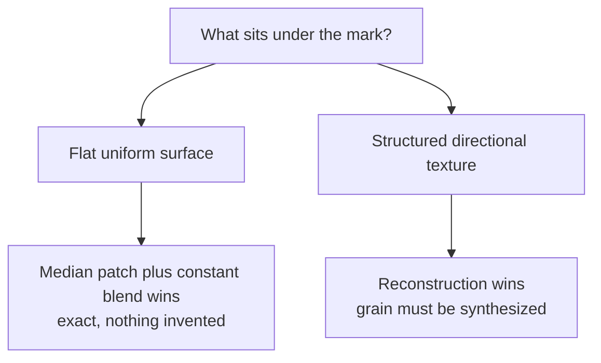
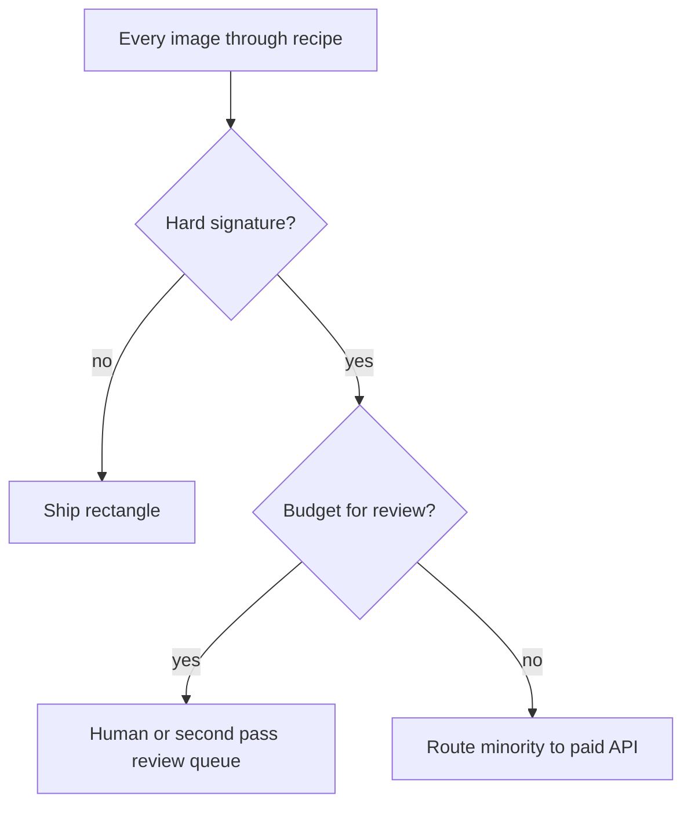

This is part four of four. Part three locked a recipe: detect three times, sample the text color from the brightest glyphs, neutralize strokes with a median patch, paint one constant rectangle at alpha 0.94. Deterministic, auditable, running at 2.3 images per second.

Before committing it to roughly half a million images I tested it against the alternatives that kept coming up. A shorter telling of this stretch appeared in [the bench post](/posts/benchmarking-the-rectangle-against-paid-and-free/). Same three hard images every time: a band crossing a window on a flat wall, a two layer purple badge on a dark warehouse, vertical text over wood grain.

## Challenger 1. Exact inversion, again

The recipe's attempt five failed on noisy per pixel alpha estimates. The challenger version gave inversion its best possible shot: template derived alpha maps fitted across sibling images, careful color fitting, the works. The result stayed the same. Division by `(1 - alpha)` magnifies template noise into streaks, and one compressed JPEG cannot supply the precision the formula demands.

Verdict: dropped for good, but kept as the control that proves patching beats recovering when inputs are imperfect.

## Challenger 2. BrushNet

BrushNet is a plug and play inpainting model from Tencent ARC, ECCV 2024. It turns any Stable Diffusion 1.5 checkpoint into an inpainting model with dense per pixel mask control. Free weights, local inference, exactly what "just use a model" prescribes.

Getting it running was most of the work:

Results on the three images, about 9.5 seconds each:

| image | BrushNet | the recipe |
|---|---|---|
| band over wall and window | flat tan patch, tone misses the wall | panel matches the wall gradient |
| purple badge on dark warehouse | muddy brown slab with ghost text | clean white panel |
| vertical text over wood grain | flat beige, no grain | beige column, no grain |

Lost all three at 20 times the cost. Structural reason: given a large rectangular mask in a small crop, a diffusion model returns an average of its training data. Plausible texture is not matching texture.

## Challenger 3. The paid service

Watermarkremover.io detects marks itself and reconstructs behind them with a heavier stack than any laptop can run, at $0.10 to $0.20 per image.

The badge case went to me. Their fill was a dark smudge reading as an editing accident; my output was a white panel reading as an intentional band. On the stated goal they did not even attempt it.

The wood grain case went to them, decisively. Text gone, grain continued so naturally I diffed images twice to believe it. My best alternative was close but weaker on continuity.

Scorecard: one to one.

## The pattern in the split

Both results follow one axis:

Flat surfaces are where arithmetic is exact and models hallucinate for nothing. Directional texture is where synthesis shines and medians leave beige columns. The hard cases even announce themselves: a mark found only by the rotated detection passes, sitting over high variance pixels.

## The fleet decision table

Corpus target 700,000 images:

| path | 700K total | quality summary |
|---|---|---|
| the recipe, local GPU | free, 3.5 to 4 days | wins flat cases, beige column on wood |
| BrushNet, my GPU | free, 54 to 81 days | lost everything |
| paid remover API | $70,000 to $140,000 | wins structured textures |
| FLUX or Qwen via API | $21,000 to $35,000 | invention risk billed per call |
| rented GPUs, self-hosted diffusion | $7,000 to $12,000 | same trust problem |

The dollar rows hide what each path actually demands in machines and wall clock time, so here is the same table read from the hardware side:

- **The recipe** fits entirely inside the laptop's 8 GB of VRAM, no crops, no tricks. At 2.0 to 2.3 images per second that is 3.5 to 4 days for 700K on a machine that costs nothing extra to run.
- **BrushNet** runs on the same card only through 512 pixel crops and 30 denoising steps per image, about 9.5 seconds each. That is 54 to 81 days of continuous laptop uptime for the corpus. Free, but two and a half months of the machine doing one thing.
- **The old inpainting pipeline** it replaces ran around half an image per second once its recheck gate was included, which is roughly sixteen days for 700K.
- **Self-hosted diffusion** is the row where my GPU disqualifies itself. Stable Diffusion class models need 24 GB+ cards at useful resolution, so "self-hosted" always meant rented A100 class machines, and the rental line is exactly where the $7,000 to $12,000 comes from.
- **The API rows** need none of my hardware; their price is per call, which is why they scale linearly with the corpus while local paths scale with days.

## The architecture this buys

If hard cases are ten percent of the corpus, that is roughly $10,000 of API spend on the subset that actually needs reconstruction, and zero dollars on the 630,000 that do not.

## The meta lesson

The paid service won exactly where a heavy diffusion stack should win, and lost exactly where statistical exactness should hold. Neither fact was knowable before the bench. The deepest finding was that "remove watermarks" and "produce images where marks are unreadable rectangles" sound like the same task and are not. The service optimizes the first goal. The recipe was built for the second, and on the second it is cheaper, deterministic, and auditable in a way no reconstruction can be.

Measure your goal, not the capability.
