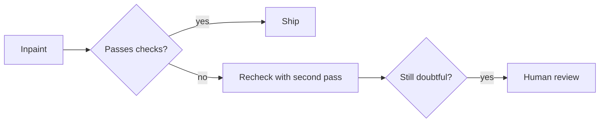

This is part two of four. Part one ended with a working pipeline that detected watermarks and let LaMa rebuild the background under them, and with three cracks in the approach: invented content, nondeterminism, and a review gate that cannot scale to hundreds of thousands of images.

This post is about the decision those cracks forced. It is also about everything I priced before accepting the answer.

## The reviews that killed erasure

I sat with cleaned outputs from real listings and compared them against their originals. The pattern was consistent enough to stop being surprising:

- Watermark bands crossing **windows** came back as smudges. The model had nothing to extend there because glass has no structure to continue.
- Bands over **textured surfaces** looked fine at a glance and wrong on inspection. Grain that continued through the masked area did not quite match grain outside it.
- The worst outputs were the convincing ones. A fill can be plausible and still invented, and only a side by side comparison reveals it.

The last point is the killer. Erasure quality is unverifiable without the original background, which nobody has. You are grading homework against an answer key that does not exist.

## What catching invention would cost

If every output needs verification, the pipeline grows a gate:

Each branch adds cost. The recheck pass measurably slowed the whole job to around half an image per second. Human review at fleet scale is arithmetic that ends the conversation: even 5 seconds per image across 489,000 images is 678 hours of someone's life.

## Pricing the alternatives before giving up on local

Before changing the goal I priced every way to keep it:

| path | per image | 700K total | verdict |
|---|---|---|---|
| watermarkremover.io | $0.10 to $0.20 | $70,000 to $140,000 | best reconstruction quality I tested |
| FLUX Kontext or Qwen image edit via API | $0.03 to $0.05 | $21,000 to $35,000 | same invention problem, now billed per hallucination |
| self-hosted diffusion on rented GPUs | ~$0.015 | $7,000 to $12,000 | needs 24 GB+ cards, same trust problem |
| LaMa locally | free | free, days of compute | the ceiling already described |

Every row keeps the same flaw in a different jacket. They all reconstruct, and reconstruction invents, and invention needs a reviewer who does not exist at this scale.

## Changing the goal instead of the tool

So I changed the goal. Not "erase the watermark" but this:

> Replace each watermark with one uniform translucent rectangle that carries the mark's own color and opacity. The text becomes unreadable. Nothing is invented.

Three acceptance criteria fell out of that sentence, and they became the test every later attempt had to pass:

1. **Deterministic.** Same image in, same pixels out, every run.
2. **Auditable.** The output must be predictable from the recipe alone, no model judgment anywhere.
3. **Honest.** The photo visibly keeps a mark. It looks deliberate, like a watermark band, not like an edit trying to hide itself.

The rectangle idea sounds like giving up. It is the opposite: it is the only goal where the output can be verified without knowing what was behind the mark. A constant blend over a neutralized surface either matches its recipe or it does not, and both facts are checkable with arithmetic.

Next: [Earning the rectangle, seven attempts deep](/posts/earning-the-rectangle-seven-attempts-deep/).
